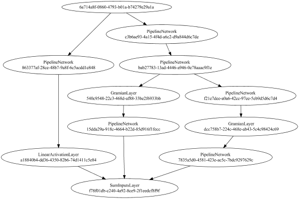

1. [Test Modules](#p-1)
1. [Network Diagram](#p-2)
1. [Small SubTests: ImgBandBiasLayer](#p-13)
1. [Small SubTests: ActivationLayer](#p-16)
1. [Small SubTests: ImgBandBiasLayer](#p-19)
1. [Small SubTests: PipelineNetwork](#p-22)
1. [Small SubTests: PoolingLayer](#p-25)
1. [Small SubTests: ImgConcatLayer](#p-28)
1. [Small SubTests: ImgBandBiasLayer](#p-31)
1. [Small SubTests: GramianLayer](#p-34)
1. [Small SubTests: SimpleConvolutionLayer](#p-37)
1. [Small SubTests: SimpleConvolutionLayer](#p-40)
1. [Small SubTests: ActivationLayer](#p-43)
1. [Small SubTests: LinearActivationLayer](#p-46)
1. [Small SubTests: ImgBandBiasLayer](#p-49)
1. [Small SubTests: ImgBandBiasLayer](#p-52)
1. [Small SubTests: PoolingLayer](#p-55)
1. [Small SubTests: SquareActivationLayer](#p-58)
1. [Small SubTests: SquareActivationLayer](#p-61)
1. [Small SubTests: SumInputsLayer](#p-64)
1. [Small SubTests: ActivationLayer](#p-67)
1. [Small SubTests: ActivationLayer](#p-70)
1. [Small SubTests: ValueLayer](#p-73)
1. [Small SubTests: GramianLayer](#p-76)
1. [Small SubTests: PipelineNetwork](#p-79)
1. [Small SubTests: PipelineNetwork](#p-82)
1. [Small SubTests: SquareActivationLayer](#p-85)
1. [Small SubTests: SumInputsLayer](#p-88)
1. [Small SubTests: ActivationLayer](#p-91)
1. [Small SubTests: ActivationLayer](#p-94)
1. [Small SubTests: ImgBandBiasLayer](#p-97)
1. [Small SubTests: ImgBandBiasLayer](#p-100)
1. [Small SubTests: PipelineNetwork](#p-103)
1. [Small SubTests: AvgReducerLayer](#p-106)
1. [Small SubTests: AvgReducerLayer](#p-109)
1. [Small SubTests: SimpleConvolutionLayer](#p-112)
1. [Small SubTests: PoolingLayer](#p-115)
1. [Small SubTests: ImgBandBiasLayer](#p-118)
1. [Small SubTests: ActivationLayer](#p-121)
1. [Small SubTests: ActivationLayer](#p-124)
1. [Small SubTests: SimpleConvolutionLayer](#p-127)
1. [Small SubTests: ImgBandBiasLayer](#p-130)
1. [Small SubTests: ImgBandBiasLayer](#p-133)
1. [Small SubTests: NthPowerActivationLayer](#p-136)
1. [Small SubTests: SimpleConvolutionLayer](#p-139)
1. [Small SubTests: AvgReducerLayer](#p-142)
1. [Small SubTests: LRNLayer](#p-145)
1. [Small SubTests: LRNLayer](#p-148)
1. [Large SubTests: ImgBandBiasLayer](#p-151)
1. [Large SubTests: ActivationLayer](#p-156)
1. [Large SubTests: ImgBandBiasLayer](#p-161)
1. [Large SubTests: PipelineNetwork](#p-166)
1. [Large SubTests: PoolingLayer](#p-171)
1. [Large SubTests: ImgConcatLayer](#p-176)
1. [Large SubTests: ImgBandBiasLayer](#p-181)
1. [Large SubTests: GramianLayer](#p-186)
1. [Large SubTests: SimpleConvolutionLayer](#p-191)
1. [Large SubTests: SimpleConvolutionLayer](#p-196)
1. [Large SubTests: ActivationLayer](#p-201)
1. [Large SubTests: LinearActivationLayer](#p-206)
1. [Large SubTests: ImgBandBiasLayer](#p-211)
1. [Large SubTests: ImgBandBiasLayer](#p-216)
1. [Large SubTests: PoolingLayer](#p-221)
1. [Large SubTests: SquareActivationLayer](#p-226)
1. [Large SubTests: SquareActivationLayer](#p-231)
1. [Large SubTests: SumInputsLayer](#p-236)
1. [Large SubTests: ActivationLayer](#p-241)
1. [Large SubTests: ActivationLayer](#p-246)
1. [Large SubTests: ValueLayer](#p-251)
1. [Large SubTests: GramianLayer](#p-256)
1. [Large SubTests: PipelineNetwork](#p-261)
1. [Large SubTests: PipelineNetwork](#p-266)
1. [Large SubTests: SquareActivationLayer](#p-271)
1. [Large SubTests: SumInputsLayer](#p-276)
1. [Large SubTests: ActivationLayer](#p-281)
1. [Large SubTests: ActivationLayer](#p-286)
1. [Large SubTests: ImgBandBiasLayer](#p-291)
1. [Large SubTests: ImgBandBiasLayer](#p-296)
1. [Large SubTests: PipelineNetwork](#p-301)
1. [Large SubTests: AvgReducerLayer](#p-306)
1. [Large SubTests: AvgReducerLayer](#p-311)
1. [Large SubTests: SimpleConvolutionLayer](#p-316)
1. [Large SubTests: ImgBandBiasLayer](#p-321)
1. [Large SubTests: PoolingLayer](#p-326)
1. [Large SubTests: ActivationLayer](#p-331)
1. [Large SubTests: ActivationLayer](#p-336)
1. [Large SubTests: SimpleConvolutionLayer](#p-341)
1. [Large SubTests: ImgBandBiasLayer](#p-346)
1. [Large SubTests: ImgBandBiasLayer](#p-351)
1. [Large SubTests: NthPowerActivationLayer](#p-356)
1. [Large SubTests: SimpleConvolutionLayer](#p-361)
1. [Large SubTests: AvgReducerLayer](#p-366)
1. [Large SubTests: LRNLayer](#p-371)
1. [Large SubTests: LRNLayer](#p-376)

<a id="p-0"></a>Subreport: log_com.simiacryptus.lang.ref.ReferenceCountingBase [markdown](getLoglog_com.simiacryptus.lang.ref.ReferenceCountingBase) [html](getLoglog_com.simiacryptus.lang.ref.ReferenceCountingBase.html) [pdf](getLoglog_com.simiacryptus.lang.ref.ReferenceCountingBase.pdf)

# <a id="p-1"></a>Test Modules
# <a id="p-2"></a>Network Diagram
<a id="p-3"></a>This is a network apply the following layout:

<a id="p-4"></a>Code from [StandardLayerTests.java:397](https://github.com/SimiaCryptus/mindseye-test/tree/444256810c541076ac97c4437963f8489a719862/src/main/java/com/simiacryptus/mindseye/test/unit/StandardLayerTests.java#L397) executed in 2.09 seconds (0.000 gc): 
```java
    return Graphviz.fromGraph((Graph) TestUtil.toGraph((DAGNetwork) smallLayer))
        .height(400).width(600).render(Format.PNG).toImage();
```
<a id="p-5"></a>Logging: 
```
    Could not initialize guru.nidi.graphviz.engine.GraphvizCmdLineEngine
    guru.nidi.graphviz.engine.GraphvizException: dot.exe command not found
    Starting V8 runtime...
    Started V8 runtime. Initializing graphviz...
    Initialized graphviz.
    
```

<a id="p-6"></a>Returns: 

<a id="p-7"></a>


<a id="p-8"></a>Using Seed 2159827126669353984

<a id="p-9"></a>Subreport: com.simiacryptus.mindseye.test.unit.SerializationTest [markdown](getLogcom.simiacryptus.mindseye.test.unit.SerializationTest) [html](getLogcom.simiacryptus.mindseye.test.unit.SerializationTest.html) [pdf](getLogcom.simiacryptus.mindseye.test.unit.SerializationTest.pdf)

<a id="p-10"></a>Subreport: com.simiacryptus.mindseye.test.unit.PerformanceTester [markdown](getLogcom.simiacryptus.mindseye.test.unit.PerformanceTester) [html](getLogcom.simiacryptus.mindseye.test.unit.PerformanceTester.html) [pdf](getLogcom.simiacryptus.mindseye.test.unit.PerformanceTester.pdf)

<a id="p-11"></a>Subreport: BatchingTester{tolerance=0.01, batchSize=2} [markdown](getLogBatchingTester%7Btolerance%3D0.01%2C+batchSize%3D2%7D) [html](getLogBatchingTester%7Btolerance%3D0.01%2C+batchSize%3D2%7D.html) [pdf](getLogBatchingTester%7Btolerance%3D0.01%2C+batchSize%3D2%7D.pdf)

<a id="p-12"></a>Subreport: com.simiacryptus.mindseye.test.unit.ReferenceIO [markdown](getLogcom.simiacryptus.mindseye.test.unit.ReferenceIO) [html](getLogcom.simiacryptus.mindseye.test.unit.ReferenceIO.html) [pdf](getLogcom.simiacryptus.mindseye.test.unit.ReferenceIO.pdf)

# <a id="p-13"></a>Small SubTests: ImgBandBiasLayer
<a id="p-14"></a>[[63, 42, 96]]

<a id="p-15"></a>Subreport: com.simiacryptus.mindseye.test.unit.SerializationTest [markdown](getLogcom.simiacryptus.mindseye.test.unit.SerializationTest) [html](getLogcom.simiacryptus.mindseye.test.unit.SerializationTest.html) [pdf](getLogcom.simiacryptus.mindseye.test.unit.SerializationTest.pdf)

# <a id="p-16"></a>Small SubTests: ActivationLayer
<a id="p-17"></a>[[63, 42, 16]]

<a id="p-18"></a>Subreport: com.simiacryptus.mindseye.test.unit.SerializationTest [markdown](getLogcom.simiacryptus.mindseye.test.unit.SerializationTest) [html](getLogcom.simiacryptus.mindseye.test.unit.SerializationTest.html) [pdf](getLogcom.simiacryptus.mindseye.test.unit.SerializationTest.pdf)

# <a id="p-19"></a>Small SubTests: ImgBandBiasLayer
<a id="p-20"></a>[[63, 42, 32]]

<a id="p-21"></a>Subreport: com.simiacryptus.mindseye.test.unit.SerializationTest [markdown](getLogcom.simiacryptus.mindseye.test.unit.SerializationTest) [html](getLogcom.simiacryptus.mindseye.test.unit.SerializationTest.html) [pdf](getLogcom.simiacryptus.mindseye.test.unit.SerializationTest.pdf)

# <a id="p-22"></a>Small SubTests: PipelineNetwork
<a id="p-23"></a>[[125, 84, 192]]

<a id="p-24"></a>Subreport: com.simiacryptus.mindseye.test.unit.SerializationTest [markdown](getLogcom.simiacryptus.mindseye.test.unit.SerializationTest) [html](getLogcom.simiacryptus.mindseye.test.unit.SerializationTest.html) [pdf](getLogcom.simiacryptus.mindseye.test.unit.SerializationTest.pdf)

# <a id="p-25"></a>Small SubTests: PoolingLayer
<a id="p-26"></a>[[125, 84, 192]]

<a id="p-27"></a>Subreport: com.simiacryptus.mindseye.test.unit.SerializationTest [markdown](getLogcom.simiacryptus.mindseye.test.unit.SerializationTest) [html](getLogcom.simiacryptus.mindseye.test.unit.SerializationTest.html) [pdf](getLogcom.simiacryptus.mindseye.test.unit.SerializationTest.pdf)

# <a id="p-28"></a>Small SubTests: ImgConcatLayer
<a id="p-29"></a>[[63, 42, 64], [63, 42, 128], [63, 42, 32], [63, 42, 32]]

<a id="p-30"></a>Subreport: com.simiacryptus.mindseye.test.unit.SerializationTest [markdown](getLogcom.simiacryptus.mindseye.test.unit.SerializationTest) [html](getLogcom.simiacryptus.mindseye.test.unit.SerializationTest.html) [pdf](getLogcom.simiacryptus.mindseye.test.unit.SerializationTest.pdf)

# <a id="p-31"></a>Small SubTests: ImgBandBiasLayer
<a id="p-32"></a>[[250, 167, 64]]

<a id="p-33"></a>Subreport: com.simiacryptus.mindseye.test.unit.SerializationTest [markdown](getLogcom.simiacryptus.mindseye.test.unit.SerializationTest) [html](getLogcom.simiacryptus.mindseye.test.unit.SerializationTest.html) [pdf](getLogcom.simiacryptus.mindseye.test.unit.SerializationTest.pdf)

# <a id="p-34"></a>Small SubTests: GramianLayer
<a id="p-35"></a>[[125, 84, 192]]

<a id="p-36"></a>Subreport: com.simiacryptus.mindseye.test.unit.SerializationTest [markdown](getLogcom.simiacryptus.mindseye.test.unit.SerializationTest) [html](getLogcom.simiacryptus.mindseye.test.unit.SerializationTest.html) [pdf](getLogcom.simiacryptus.mindseye.test.unit.SerializationTest.pdf)

# <a id="p-37"></a>Small SubTests: SimpleConvolutionLayer
<a id="p-38"></a>[[63, 42, 96]]

<a id="p-39"></a>Subreport: com.simiacryptus.mindseye.test.unit.SerializationTest [markdown](getLogcom.simiacryptus.mindseye.test.unit.SerializationTest) [html](getLogcom.simiacryptus.mindseye.test.unit.SerializationTest.html) [pdf](getLogcom.simiacryptus.mindseye.test.unit.SerializationTest.pdf)

# <a id="p-40"></a>Small SubTests: SimpleConvolutionLayer
<a id="p-41"></a>[[125, 84, 64]]

<a id="p-42"></a>Subreport: com.simiacryptus.mindseye.test.unit.SerializationTest [markdown](getLogcom.simiacryptus.mindseye.test.unit.SerializationTest) [html](getLogcom.simiacryptus.mindseye.test.unit.SerializationTest.html) [pdf](getLogcom.simiacryptus.mindseye.test.unit.SerializationTest.pdf)

# <a id="p-43"></a>Small SubTests: ActivationLayer
<a id="p-44"></a>[[250, 167, 64]]

<a id="p-45"></a>Subreport: com.simiacryptus.mindseye.test.unit.SerializationTest [markdown](getLogcom.simiacryptus.mindseye.test.unit.SerializationTest) [html](getLogcom.simiacryptus.mindseye.test.unit.SerializationTest.html) [pdf](getLogcom.simiacryptus.mindseye.test.unit.SerializationTest.pdf)

# <a id="p-46"></a>Small SubTests: LinearActivationLayer
<a id="p-47"></a>[[1, 1, 1]]

<a id="p-48"></a>Subreport: com.simiacryptus.mindseye.test.unit.SerializationTest [markdown](getLogcom.simiacryptus.mindseye.test.unit.SerializationTest) [html](getLogcom.simiacryptus.mindseye.test.unit.SerializationTest.html) [pdf](getLogcom.simiacryptus.mindseye.test.unit.SerializationTest.pdf)

# <a id="p-49"></a>Small SubTests: ImgBandBiasLayer
<a id="p-50"></a>[[125, 84, 64]]

<a id="p-51"></a>Subreport: com.simiacryptus.mindseye.test.unit.SerializationTest [markdown](getLogcom.simiacryptus.mindseye.test.unit.SerializationTest) [html](getLogcom.simiacryptus.mindseye.test.unit.SerializationTest.html) [pdf](getLogcom.simiacryptus.mindseye.test.unit.SerializationTest.pdf)

# <a id="p-52"></a>Small SubTests: ImgBandBiasLayer
<a id="p-53"></a>[[125, 84, 192]]

<a id="p-54"></a>Subreport: com.simiacryptus.mindseye.test.unit.SerializationTest [markdown](getLogcom.simiacryptus.mindseye.test.unit.SerializationTest) [html](getLogcom.simiacryptus.mindseye.test.unit.SerializationTest.html) [pdf](getLogcom.simiacryptus.mindseye.test.unit.SerializationTest.pdf)

# <a id="p-55"></a>Small SubTests: PoolingLayer
<a id="p-56"></a>[[250, 167, 64]]

<a id="p-57"></a>Subreport: com.simiacryptus.mindseye.test.unit.SerializationTest [markdown](getLogcom.simiacryptus.mindseye.test.unit.SerializationTest) [html](getLogcom.simiacryptus.mindseye.test.unit.SerializationTest.html) [pdf](getLogcom.simiacryptus.mindseye.test.unit.SerializationTest.pdf)

# <a id="p-58"></a>Small SubTests: SquareActivationLayer
<a id="p-59"></a>[[1, 1, 36864]]

<a id="p-60"></a>Subreport: com.simiacryptus.mindseye.test.unit.SerializationTest [markdown](getLogcom.simiacryptus.mindseye.test.unit.SerializationTest) [html](getLogcom.simiacryptus.mindseye.test.unit.SerializationTest.html) [pdf](getLogcom.simiacryptus.mindseye.test.unit.SerializationTest.pdf)

# <a id="p-61"></a>Small SubTests: SquareActivationLayer
<a id="p-62"></a>[[1, 1, 65536]]

<a id="p-63"></a>Subreport: com.simiacryptus.mindseye.test.unit.SerializationTest [markdown](getLogcom.simiacryptus.mindseye.test.unit.SerializationTest) [html](getLogcom.simiacryptus.mindseye.test.unit.SerializationTest.html) [pdf](getLogcom.simiacryptus.mindseye.test.unit.SerializationTest.pdf)

# <a id="p-64"></a>Small SubTests: SumInputsLayer
<a id="p-65"></a>[[1, 1, 1], [1, 1, 1], [1, 1, 1]]

<a id="p-66"></a>Subreport: com.simiacryptus.mindseye.test.unit.SerializationTest [markdown](getLogcom.simiacryptus.mindseye.test.unit.SerializationTest) [html](getLogcom.simiacryptus.mindseye.test.unit.SerializationTest.html) [pdf](getLogcom.simiacryptus.mindseye.test.unit.SerializationTest.pdf)

# <a id="p-67"></a>Small SubTests: ActivationLayer
<a id="p-68"></a>[[63, 42, 96]]

<a id="p-69"></a>Subreport: com.simiacryptus.mindseye.test.unit.SerializationTest [markdown](getLogcom.simiacryptus.mindseye.test.unit.SerializationTest) [html](getLogcom.simiacryptus.mindseye.test.unit.SerializationTest.html) [pdf](getLogcom.simiacryptus.mindseye.test.unit.SerializationTest.pdf)

# <a id="p-70"></a>Small SubTests: ActivationLayer
<a id="p-71"></a>[[63, 42, 32]]

<a id="p-72"></a>Subreport: com.simiacryptus.mindseye.test.unit.SerializationTest [markdown](getLogcom.simiacryptus.mindseye.test.unit.SerializationTest) [html](getLogcom.simiacryptus.mindseye.test.unit.SerializationTest.html) [pdf](getLogcom.simiacryptus.mindseye.test.unit.SerializationTest.pdf)

# <a id="p-73"></a>Small SubTests: ValueLayer
<a id="p-74"></a>[]

<a id="p-75"></a>Subreport: com.simiacryptus.mindseye.test.unit.SerializationTest [markdown](getLogcom.simiacryptus.mindseye.test.unit.SerializationTest) [html](getLogcom.simiacryptus.mindseye.test.unit.SerializationTest.html) [pdf](getLogcom.simiacryptus.mindseye.test.unit.SerializationTest.pdf)

# <a id="p-76"></a>Small SubTests: GramianLayer
<a id="p-77"></a>[[63, 42, 256]]

<a id="p-78"></a>Subreport: com.simiacryptus.mindseye.test.unit.SerializationTest [markdown](getLogcom.simiacryptus.mindseye.test.unit.SerializationTest) [html](getLogcom.simiacryptus.mindseye.test.unit.SerializationTest.html) [pdf](getLogcom.simiacryptus.mindseye.test.unit.SerializationTest.pdf)

# <a id="p-79"></a>Small SubTests: PipelineNetwork
<a id="p-80"></a>[[1, 1, 36864]]

<a id="p-81"></a>Subreport: com.simiacryptus.mindseye.test.unit.SerializationTest [markdown](getLogcom.simiacryptus.mindseye.test.unit.SerializationTest) [html](getLogcom.simiacryptus.mindseye.test.unit.SerializationTest.html) [pdf](getLogcom.simiacryptus.mindseye.test.unit.SerializationTest.pdf)

# <a id="p-82"></a>Small SubTests: PipelineNetwork
<a id="p-83"></a>[[1, 1, 65536]]

<a id="p-84"></a>Subreport: com.simiacryptus.mindseye.test.unit.SerializationTest [markdown](getLogcom.simiacryptus.mindseye.test.unit.SerializationTest) [html](getLogcom.simiacryptus.mindseye.test.unit.SerializationTest.html) [pdf](getLogcom.simiacryptus.mindseye.test.unit.SerializationTest.pdf)

# <a id="p-85"></a>Small SubTests: SquareActivationLayer
<a id="p-86"></a>[[500, 333, 3]]

<a id="p-87"></a>Subreport: com.simiacryptus.mindseye.test.unit.SerializationTest [markdown](getLogcom.simiacryptus.mindseye.test.unit.SerializationTest) [html](getLogcom.simiacryptus.mindseye.test.unit.SerializationTest.html) [pdf](getLogcom.simiacryptus.mindseye.test.unit.SerializationTest.pdf)

# <a id="p-88"></a>Small SubTests: SumInputsLayer
<a id="p-89"></a>[[500, 333, 3], [500, 333, 3]]

<a id="p-90"></a>Subreport: com.simiacryptus.mindseye.test.unit.SerializationTest [markdown](getLogcom.simiacryptus.mindseye.test.unit.SerializationTest) [html](getLogcom.simiacryptus.mindseye.test.unit.SerializationTest.html) [pdf](getLogcom.simiacryptus.mindseye.test.unit.SerializationTest.pdf)

# <a id="p-91"></a>Small SubTests: ActivationLayer
<a id="p-92"></a>[[125, 84, 64]]

<a id="p-93"></a>Subreport: com.simiacryptus.mindseye.test.unit.SerializationTest [markdown](getLogcom.simiacryptus.mindseye.test.unit.SerializationTest) [html](getLogcom.simiacryptus.mindseye.test.unit.SerializationTest.html) [pdf](getLogcom.simiacryptus.mindseye.test.unit.SerializationTest.pdf)

# <a id="p-94"></a>Small SubTests: ActivationLayer
<a id="p-95"></a>[[125, 84, 192]]

<a id="p-96"></a>Subreport: com.simiacryptus.mindseye.test.unit.SerializationTest [markdown](getLogcom.simiacryptus.mindseye.test.unit.SerializationTest) [html](getLogcom.simiacryptus.mindseye.test.unit.SerializationTest.html) [pdf](getLogcom.simiacryptus.mindseye.test.unit.SerializationTest.pdf)

# <a id="p-97"></a>Small SubTests: ImgBandBiasLayer
<a id="p-98"></a>[[63, 42, 64]]

<a id="p-99"></a>Subreport: com.simiacryptus.mindseye.test.unit.SerializationTest [markdown](getLogcom.simiacryptus.mindseye.test.unit.SerializationTest) [html](getLogcom.simiacryptus.mindseye.test.unit.SerializationTest.html) [pdf](getLogcom.simiacryptus.mindseye.test.unit.SerializationTest.pdf)

# <a id="p-100"></a>Small SubTests: ImgBandBiasLayer
<a id="p-101"></a>[[63, 42, 128]]

<a id="p-102"></a>Subreport: com.simiacryptus.mindseye.test.unit.SerializationTest [markdown](getLogcom.simiacryptus.mindseye.test.unit.SerializationTest) [html](getLogcom.simiacryptus.mindseye.test.unit.SerializationTest.html) [pdf](getLogcom.simiacryptus.mindseye.test.unit.SerializationTest.pdf)

# <a id="p-103"></a>Small SubTests: PipelineNetwork
<a id="p-104"></a>[[500, 333, 3]]

<a id="p-105"></a>Subreport: com.simiacryptus.mindseye.test.unit.SerializationTest [markdown](getLogcom.simiacryptus.mindseye.test.unit.SerializationTest) [html](getLogcom.simiacryptus.mindseye.test.unit.SerializationTest.html) [pdf](getLogcom.simiacryptus.mindseye.test.unit.SerializationTest.pdf)

# <a id="p-106"></a>Small SubTests: AvgReducerLayer
<a id="p-107"></a>[[1, 1, 36864]]

<a id="p-108"></a>Subreport: com.simiacryptus.mindseye.test.unit.SerializationTest [markdown](getLogcom.simiacryptus.mindseye.test.unit.SerializationTest) [html](getLogcom.simiacryptus.mindseye.test.unit.SerializationTest.html) [pdf](getLogcom.simiacryptus.mindseye.test.unit.SerializationTest.pdf)

# <a id="p-109"></a>Small SubTests: AvgReducerLayer
<a id="p-110"></a>[[1, 1, 65536]]

<a id="p-111"></a>Subreport: com.simiacryptus.mindseye.test.unit.SerializationTest [markdown](getLogcom.simiacryptus.mindseye.test.unit.SerializationTest) [html](getLogcom.simiacryptus.mindseye.test.unit.SerializationTest.html) [pdf](getLogcom.simiacryptus.mindseye.test.unit.SerializationTest.pdf)

# <a id="p-112"></a>Small SubTests: SimpleConvolutionLayer
<a id="p-113"></a>[[63, 42, 192]]

<a id="p-114"></a>Subreport: com.simiacryptus.mindseye.test.unit.SerializationTest [markdown](getLogcom.simiacryptus.mindseye.test.unit.SerializationTest) [html](getLogcom.simiacryptus.mindseye.test.unit.SerializationTest.html) [pdf](getLogcom.simiacryptus.mindseye.test.unit.SerializationTest.pdf)

# <a id="p-115"></a>Small SubTests: PoolingLayer
<a id="p-116"></a>[[63, 42, 192]]

<a id="p-117"></a>Subreport: com.simiacryptus.mindseye.test.unit.SerializationTest [markdown](getLogcom.simiacryptus.mindseye.test.unit.SerializationTest) [html](getLogcom.simiacryptus.mindseye.test.unit.SerializationTest.html) [pdf](getLogcom.simiacryptus.mindseye.test.unit.SerializationTest.pdf)

# <a id="p-118"></a>Small SubTests: ImgBandBiasLayer
<a id="p-119"></a>[[63, 42, 16]]

<a id="p-120"></a>Subreport: com.simiacryptus.mindseye.test.unit.SerializationTest [markdown](getLogcom.simiacryptus.mindseye.test.unit.SerializationTest) [html](getLogcom.simiacryptus.mindseye.test.unit.SerializationTest.html) [pdf](getLogcom.simiacryptus.mindseye.test.unit.SerializationTest.pdf)

# <a id="p-121"></a>Small SubTests: ActivationLayer
<a id="p-122"></a>[[63, 42, 64]]

<a id="p-123"></a>Subreport: com.simiacryptus.mindseye.test.unit.SerializationTest [markdown](getLogcom.simiacryptus.mindseye.test.unit.SerializationTest) [html](getLogcom.simiacryptus.mindseye.test.unit.SerializationTest.html) [pdf](getLogcom.simiacryptus.mindseye.test.unit.SerializationTest.pdf)

# <a id="p-124"></a>Small SubTests: ActivationLayer
<a id="p-125"></a>[[63, 42, 128]]

<a id="p-126"></a>Subreport: com.simiacryptus.mindseye.test.unit.SerializationTest [markdown](getLogcom.simiacryptus.mindseye.test.unit.SerializationTest) [html](getLogcom.simiacryptus.mindseye.test.unit.SerializationTest.html) [pdf](getLogcom.simiacryptus.mindseye.test.unit.SerializationTest.pdf)

# <a id="p-127"></a>Small SubTests: SimpleConvolutionLayer
<a id="p-128"></a>[[500, 333, 3]]

<a id="p-129"></a>Subreport: com.simiacryptus.mindseye.test.unit.SerializationTest [markdown](getLogcom.simiacryptus.mindseye.test.unit.SerializationTest) [html](getLogcom.simiacryptus.mindseye.test.unit.SerializationTest.html) [pdf](getLogcom.simiacryptus.mindseye.test.unit.SerializationTest.pdf)

# <a id="p-130"></a>Small SubTests: ImgBandBiasLayer
<a id="p-131"></a>[[1, 1, 36864]]

<a id="p-132"></a>Subreport: com.simiacryptus.mindseye.test.unit.SerializationTest [markdown](getLogcom.simiacryptus.mindseye.test.unit.SerializationTest) [html](getLogcom.simiacryptus.mindseye.test.unit.SerializationTest.html) [pdf](getLogcom.simiacryptus.mindseye.test.unit.SerializationTest.pdf)

# <a id="p-133"></a>Small SubTests: ImgBandBiasLayer
<a id="p-134"></a>[[1, 1, 65536]]

<a id="p-135"></a>Subreport: com.simiacryptus.mindseye.test.unit.SerializationTest [markdown](getLogcom.simiacryptus.mindseye.test.unit.SerializationTest) [html](getLogcom.simiacryptus.mindseye.test.unit.SerializationTest.html) [pdf](getLogcom.simiacryptus.mindseye.test.unit.SerializationTest.pdf)

# <a id="p-136"></a>Small SubTests: NthPowerActivationLayer
<a id="p-137"></a>[[1, 1, 1]]

<a id="p-138"></a>Subreport: com.simiacryptus.mindseye.test.unit.SerializationTest [markdown](getLogcom.simiacryptus.mindseye.test.unit.SerializationTest) [html](getLogcom.simiacryptus.mindseye.test.unit.SerializationTest.html) [pdf](getLogcom.simiacryptus.mindseye.test.unit.SerializationTest.pdf)

# <a id="p-139"></a>Small SubTests: SimpleConvolutionLayer
<a id="p-140"></a>[[63, 42, 16]]

<a id="p-141"></a>Subreport: com.simiacryptus.mindseye.test.unit.SerializationTest [markdown](getLogcom.simiacryptus.mindseye.test.unit.SerializationTest) [html](getLogcom.simiacryptus.mindseye.test.unit.SerializationTest.html) [pdf](getLogcom.simiacryptus.mindseye.test.unit.SerializationTest.pdf)

# <a id="p-142"></a>Small SubTests: AvgReducerLayer
<a id="p-143"></a>[[500, 333, 3]]

<a id="p-144"></a>Subreport: com.simiacryptus.mindseye.test.unit.SerializationTest [markdown](getLogcom.simiacryptus.mindseye.test.unit.SerializationTest) [html](getLogcom.simiacryptus.mindseye.test.unit.SerializationTest.html) [pdf](getLogcom.simiacryptus.mindseye.test.unit.SerializationTest.pdf)

# <a id="p-145"></a>Small SubTests: LRNLayer
<a id="p-146"></a>[[125, 84, 64]]

<a id="p-147"></a>Subreport: com.simiacryptus.mindseye.test.unit.SerializationTest [markdown](getLogcom.simiacryptus.mindseye.test.unit.SerializationTest) [html](getLogcom.simiacryptus.mindseye.test.unit.SerializationTest.html) [pdf](getLogcom.simiacryptus.mindseye.test.unit.SerializationTest.pdf)

# <a id="p-148"></a>Small SubTests: LRNLayer
<a id="p-149"></a>[[125, 84, 192]]

<a id="p-150"></a>Subreport: com.simiacryptus.mindseye.test.unit.SerializationTest [markdown](getLogcom.simiacryptus.mindseye.test.unit.SerializationTest) [html](getLogcom.simiacryptus.mindseye.test.unit.SerializationTest.html) [pdf](getLogcom.simiacryptus.mindseye.test.unit.SerializationTest.pdf)

# <a id="p-151"></a>Large SubTests: ImgBandBiasLayer
<a id="p-152"></a>[[63, 42, 96]]

<a id="p-153"></a>Subreport: com.simiacryptus.mindseye.test.unit.PerformanceTester [markdown](getLogcom.simiacryptus.mindseye.test.unit.PerformanceTester) [html](getLogcom.simiacryptus.mindseye.test.unit.PerformanceTester.html) [pdf](getLogcom.simiacryptus.mindseye.test.unit.PerformanceTester.pdf)

<a id="p-154"></a>Subreport:  [markdown](getLog) [html](getLog.html) [pdf](getLog.pdf)

<a id="p-155"></a>Subreport: com.simiacryptus.mindseye.test.unit.ReferenceIO [markdown](getLogcom.simiacryptus.mindseye.test.unit.ReferenceIO) [html](getLogcom.simiacryptus.mindseye.test.unit.ReferenceIO.html) [pdf](getLogcom.simiacryptus.mindseye.test.unit.ReferenceIO.pdf)

# <a id="p-156"></a>Large SubTests: ActivationLayer
<a id="p-157"></a>[[63, 42, 16]]

<a id="p-158"></a>Subreport: com.simiacryptus.mindseye.test.unit.PerformanceTester [markdown](getLogcom.simiacryptus.mindseye.test.unit.PerformanceTester) [html](getLogcom.simiacryptus.mindseye.test.unit.PerformanceTester.html) [pdf](getLogcom.simiacryptus.mindseye.test.unit.PerformanceTester.pdf)

<a id="p-159"></a>Subreport:  [markdown](getLog) [html](getLog.html) [pdf](getLog.pdf)

<a id="p-160"></a>Subreport: com.simiacryptus.mindseye.test.unit.ReferenceIO [markdown](getLogcom.simiacryptus.mindseye.test.unit.ReferenceIO) [html](getLogcom.simiacryptus.mindseye.test.unit.ReferenceIO.html) [pdf](getLogcom.simiacryptus.mindseye.test.unit.ReferenceIO.pdf)

# <a id="p-161"></a>Large SubTests: ImgBandBiasLayer
<a id="p-162"></a>[[63, 42, 32]]

<a id="p-163"></a>Subreport: com.simiacryptus.mindseye.test.unit.PerformanceTester [markdown](getLogcom.simiacryptus.mindseye.test.unit.PerformanceTester) [html](getLogcom.simiacryptus.mindseye.test.unit.PerformanceTester.html) [pdf](getLogcom.simiacryptus.mindseye.test.unit.PerformanceTester.pdf)

<a id="p-164"></a>Subreport:  [markdown](getLog) [html](getLog.html) [pdf](getLog.pdf)

<a id="p-165"></a>Subreport: com.simiacryptus.mindseye.test.unit.ReferenceIO [markdown](getLogcom.simiacryptus.mindseye.test.unit.ReferenceIO) [html](getLogcom.simiacryptus.mindseye.test.unit.ReferenceIO.html) [pdf](getLogcom.simiacryptus.mindseye.test.unit.ReferenceIO.pdf)

# <a id="p-166"></a>Large SubTests: PipelineNetwork
<a id="p-167"></a>[[125, 84, 192]]

<a id="p-168"></a>Subreport: com.simiacryptus.mindseye.test.unit.PerformanceTester [markdown](getLogcom.simiacryptus.mindseye.test.unit.PerformanceTester) [html](getLogcom.simiacryptus.mindseye.test.unit.PerformanceTester.html) [pdf](getLogcom.simiacryptus.mindseye.test.unit.PerformanceTester.pdf)

<a id="p-169"></a>Subreport:  [markdown](getLog) [html](getLog.html) [pdf](getLog.pdf)

<a id="p-170"></a>Subreport: com.simiacryptus.mindseye.test.unit.ReferenceIO [markdown](getLogcom.simiacryptus.mindseye.test.unit.ReferenceIO) [html](getLogcom.simiacryptus.mindseye.test.unit.ReferenceIO.html) [pdf](getLogcom.simiacryptus.mindseye.test.unit.ReferenceIO.pdf)

# <a id="p-171"></a>Large SubTests: PoolingLayer
<a id="p-172"></a>[[125, 84, 192]]

<a id="p-173"></a>Subreport: com.simiacryptus.mindseye.test.unit.PerformanceTester [markdown](getLogcom.simiacryptus.mindseye.test.unit.PerformanceTester) [html](getLogcom.simiacryptus.mindseye.test.unit.PerformanceTester.html) [pdf](getLogcom.simiacryptus.mindseye.test.unit.PerformanceTester.pdf)

<a id="p-174"></a>Subreport:  [markdown](getLog) [html](getLog.html) [pdf](getLog.pdf)

<a id="p-175"></a>Subreport: com.simiacryptus.mindseye.test.unit.ReferenceIO [markdown](getLogcom.simiacryptus.mindseye.test.unit.ReferenceIO) [html](getLogcom.simiacryptus.mindseye.test.unit.ReferenceIO.html) [pdf](getLogcom.simiacryptus.mindseye.test.unit.ReferenceIO.pdf)

# <a id="p-176"></a>Large SubTests: ImgConcatLayer
<a id="p-177"></a>[[63, 42, 64], [63, 42, 128], [63, 42, 32], [63, 42, 32]]

<a id="p-178"></a>Subreport: com.simiacryptus.mindseye.test.unit.PerformanceTester [markdown](getLogcom.simiacryptus.mindseye.test.unit.PerformanceTester) [html](getLogcom.simiacryptus.mindseye.test.unit.PerformanceTester.html) [pdf](getLogcom.simiacryptus.mindseye.test.unit.PerformanceTester.pdf)

<a id="p-179"></a>Subreport:  [markdown](getLog) [html](getLog.html) [pdf](getLog.pdf)

<a id="p-180"></a>Subreport: com.simiacryptus.mindseye.test.unit.ReferenceIO [markdown](getLogcom.simiacryptus.mindseye.test.unit.ReferenceIO) [html](getLogcom.simiacryptus.mindseye.test.unit.ReferenceIO.html) [pdf](getLogcom.simiacryptus.mindseye.test.unit.ReferenceIO.pdf)

# <a id="p-181"></a>Large SubTests: ImgBandBiasLayer
<a id="p-182"></a>[[250, 167, 64]]

<a id="p-183"></a>Subreport: com.simiacryptus.mindseye.test.unit.PerformanceTester [markdown](getLogcom.simiacryptus.mindseye.test.unit.PerformanceTester) [html](getLogcom.simiacryptus.mindseye.test.unit.PerformanceTester.html) [pdf](getLogcom.simiacryptus.mindseye.test.unit.PerformanceTester.pdf)

<a id="p-184"></a>Subreport:  [markdown](getLog) [html](getLog.html) [pdf](getLog.pdf)

<a id="p-185"></a>Subreport: com.simiacryptus.mindseye.test.unit.ReferenceIO [markdown](getLogcom.simiacryptus.mindseye.test.unit.ReferenceIO) [html](getLogcom.simiacryptus.mindseye.test.unit.ReferenceIO.html) [pdf](getLogcom.simiacryptus.mindseye.test.unit.ReferenceIO.pdf)

# <a id="p-186"></a>Large SubTests: GramianLayer
<a id="p-187"></a>[[125, 84, 192]]

<a id="p-188"></a>Subreport: com.simiacryptus.mindseye.test.unit.PerformanceTester [markdown](getLogcom.simiacryptus.mindseye.test.unit.PerformanceTester) [html](getLogcom.simiacryptus.mindseye.test.unit.PerformanceTester.html) [pdf](getLogcom.simiacryptus.mindseye.test.unit.PerformanceTester.pdf)

<a id="p-189"></a>Subreport:  [markdown](getLog) [html](getLog.html) [pdf](getLog.pdf)

<a id="p-190"></a>Subreport: com.simiacryptus.mindseye.test.unit.ReferenceIO [markdown](getLogcom.simiacryptus.mindseye.test.unit.ReferenceIO) [html](getLogcom.simiacryptus.mindseye.test.unit.ReferenceIO.html) [pdf](getLogcom.simiacryptus.mindseye.test.unit.ReferenceIO.pdf)

# <a id="p-191"></a>Large SubTests: SimpleConvolutionLayer
<a id="p-192"></a>[[63, 42, 96]]

<a id="p-193"></a>Subreport: com.simiacryptus.mindseye.test.unit.PerformanceTester [markdown](getLogcom.simiacryptus.mindseye.test.unit.PerformanceTester) [html](getLogcom.simiacryptus.mindseye.test.unit.PerformanceTester.html) [pdf](getLogcom.simiacryptus.mindseye.test.unit.PerformanceTester.pdf)

<a id="p-194"></a>Subreport:  [markdown](getLog) [html](getLog.html) [pdf](getLog.pdf)

<a id="p-195"></a>Subreport: com.simiacryptus.mindseye.test.unit.ReferenceIO [markdown](getLogcom.simiacryptus.mindseye.test.unit.ReferenceIO) [html](getLogcom.simiacryptus.mindseye.test.unit.ReferenceIO.html) [pdf](getLogcom.simiacryptus.mindseye.test.unit.ReferenceIO.pdf)

# <a id="p-196"></a>Large SubTests: SimpleConvolutionLayer
<a id="p-197"></a>[[125, 84, 64]]

<a id="p-198"></a>Subreport: com.simiacryptus.mindseye.test.unit.PerformanceTester [markdown](getLogcom.simiacryptus.mindseye.test.unit.PerformanceTester) [html](getLogcom.simiacryptus.mindseye.test.unit.PerformanceTester.html) [pdf](getLogcom.simiacryptus.mindseye.test.unit.PerformanceTester.pdf)

<a id="p-199"></a>Subreport:  [markdown](getLog) [html](getLog.html) [pdf](getLog.pdf)

<a id="p-200"></a>Subreport: com.simiacryptus.mindseye.test.unit.ReferenceIO [markdown](getLogcom.simiacryptus.mindseye.test.unit.ReferenceIO) [html](getLogcom.simiacryptus.mindseye.test.unit.ReferenceIO.html) [pdf](getLogcom.simiacryptus.mindseye.test.unit.ReferenceIO.pdf)

# <a id="p-201"></a>Large SubTests: ActivationLayer
<a id="p-202"></a>[[250, 167, 64]]

<a id="p-203"></a>Subreport: com.simiacryptus.mindseye.test.unit.PerformanceTester [markdown](getLogcom.simiacryptus.mindseye.test.unit.PerformanceTester) [html](getLogcom.simiacryptus.mindseye.test.unit.PerformanceTester.html) [pdf](getLogcom.simiacryptus.mindseye.test.unit.PerformanceTester.pdf)

<a id="p-204"></a>Subreport:  [markdown](getLog) [html](getLog.html) [pdf](getLog.pdf)

<a id="p-205"></a>Subreport: com.simiacryptus.mindseye.test.unit.ReferenceIO [markdown](getLogcom.simiacryptus.mindseye.test.unit.ReferenceIO) [html](getLogcom.simiacryptus.mindseye.test.unit.ReferenceIO.html) [pdf](getLogcom.simiacryptus.mindseye.test.unit.ReferenceIO.pdf)

# <a id="p-206"></a>Large SubTests: LinearActivationLayer
<a id="p-207"></a>[[1, 1, 1]]

<a id="p-208"></a>Subreport: com.simiacryptus.mindseye.test.unit.PerformanceTester [markdown](getLogcom.simiacryptus.mindseye.test.unit.PerformanceTester) [html](getLogcom.simiacryptus.mindseye.test.unit.PerformanceTester.html) [pdf](getLogcom.simiacryptus.mindseye.test.unit.PerformanceTester.pdf)

<a id="p-209"></a>Subreport:  [markdown](getLog) [html](getLog.html) [pdf](getLog.pdf)

<a id="p-210"></a>Subreport: com.simiacryptus.mindseye.test.unit.ReferenceIO [markdown](getLogcom.simiacryptus.mindseye.test.unit.ReferenceIO) [html](getLogcom.simiacryptus.mindseye.test.unit.ReferenceIO.html) [pdf](getLogcom.simiacryptus.mindseye.test.unit.ReferenceIO.pdf)

# <a id="p-211"></a>Large SubTests: ImgBandBiasLayer
<a id="p-212"></a>[[125, 84, 64]]

<a id="p-213"></a>Subreport: com.simiacryptus.mindseye.test.unit.PerformanceTester [markdown](getLogcom.simiacryptus.mindseye.test.unit.PerformanceTester) [html](getLogcom.simiacryptus.mindseye.test.unit.PerformanceTester.html) [pdf](getLogcom.simiacryptus.mindseye.test.unit.PerformanceTester.pdf)

<a id="p-214"></a>Subreport:  [markdown](getLog) [html](getLog.html) [pdf](getLog.pdf)

<a id="p-215"></a>Subreport: com.simiacryptus.mindseye.test.unit.ReferenceIO [markdown](getLogcom.simiacryptus.mindseye.test.unit.ReferenceIO) [html](getLogcom.simiacryptus.mindseye.test.unit.ReferenceIO.html) [pdf](getLogcom.simiacryptus.mindseye.test.unit.ReferenceIO.pdf)

# <a id="p-216"></a>Large SubTests: ImgBandBiasLayer
<a id="p-217"></a>[[125, 84, 192]]

<a id="p-218"></a>Subreport: com.simiacryptus.mindseye.test.unit.PerformanceTester [markdown](getLogcom.simiacryptus.mindseye.test.unit.PerformanceTester) [html](getLogcom.simiacryptus.mindseye.test.unit.PerformanceTester.html) [pdf](getLogcom.simiacryptus.mindseye.test.unit.PerformanceTester.pdf)

<a id="p-219"></a>Subreport:  [markdown](getLog) [html](getLog.html) [pdf](getLog.pdf)

<a id="p-220"></a>Subreport: com.simiacryptus.mindseye.test.unit.ReferenceIO [markdown](getLogcom.simiacryptus.mindseye.test.unit.ReferenceIO) [html](getLogcom.simiacryptus.mindseye.test.unit.ReferenceIO.html) [pdf](getLogcom.simiacryptus.mindseye.test.unit.ReferenceIO.pdf)

# <a id="p-221"></a>Large SubTests: PoolingLayer
<a id="p-222"></a>[[250, 167, 64]]

<a id="p-223"></a>Subreport: com.simiacryptus.mindseye.test.unit.PerformanceTester [markdown](getLogcom.simiacryptus.mindseye.test.unit.PerformanceTester) [html](getLogcom.simiacryptus.mindseye.test.unit.PerformanceTester.html) [pdf](getLogcom.simiacryptus.mindseye.test.unit.PerformanceTester.pdf)

<a id="p-224"></a>Subreport:  [markdown](getLog) [html](getLog.html) [pdf](getLog.pdf)

<a id="p-225"></a>Subreport: com.simiacryptus.mindseye.test.unit.ReferenceIO [markdown](getLogcom.simiacryptus.mindseye.test.unit.ReferenceIO) [html](getLogcom.simiacryptus.mindseye.test.unit.ReferenceIO.html) [pdf](getLogcom.simiacryptus.mindseye.test.unit.ReferenceIO.pdf)

# <a id="p-226"></a>Large SubTests: SquareActivationLayer
<a id="p-227"></a>[[1, 1, 36864]]

<a id="p-228"></a>Subreport: com.simiacryptus.mindseye.test.unit.PerformanceTester [markdown](getLogcom.simiacryptus.mindseye.test.unit.PerformanceTester) [html](getLogcom.simiacryptus.mindseye.test.unit.PerformanceTester.html) [pdf](getLogcom.simiacryptus.mindseye.test.unit.PerformanceTester.pdf)

<a id="p-229"></a>Subreport:  [markdown](getLog) [html](getLog.html) [pdf](getLog.pdf)

<a id="p-230"></a>Subreport: com.simiacryptus.mindseye.test.unit.ReferenceIO [markdown](getLogcom.simiacryptus.mindseye.test.unit.ReferenceIO) [html](getLogcom.simiacryptus.mindseye.test.unit.ReferenceIO.html) [pdf](getLogcom.simiacryptus.mindseye.test.unit.ReferenceIO.pdf)

# <a id="p-231"></a>Large SubTests: SquareActivationLayer
<a id="p-232"></a>[[1, 1, 65536]]

<a id="p-233"></a>Subreport: com.simiacryptus.mindseye.test.unit.PerformanceTester [markdown](getLogcom.simiacryptus.mindseye.test.unit.PerformanceTester) [html](getLogcom.simiacryptus.mindseye.test.unit.PerformanceTester.html) [pdf](getLogcom.simiacryptus.mindseye.test.unit.PerformanceTester.pdf)

<a id="p-234"></a>Subreport:  [markdown](getLog) [html](getLog.html) [pdf](getLog.pdf)

<a id="p-235"></a>Subreport: com.simiacryptus.mindseye.test.unit.ReferenceIO [markdown](getLogcom.simiacryptus.mindseye.test.unit.ReferenceIO) [html](getLogcom.simiacryptus.mindseye.test.unit.ReferenceIO.html) [pdf](getLogcom.simiacryptus.mindseye.test.unit.ReferenceIO.pdf)

# <a id="p-236"></a>Large SubTests: SumInputsLayer
<a id="p-237"></a>[[1, 1, 1], [1, 1, 1], [1, 1, 1]]

<a id="p-238"></a>Subreport: com.simiacryptus.mindseye.test.unit.PerformanceTester [markdown](getLogcom.simiacryptus.mindseye.test.unit.PerformanceTester) [html](getLogcom.simiacryptus.mindseye.test.unit.PerformanceTester.html) [pdf](getLogcom.simiacryptus.mindseye.test.unit.PerformanceTester.pdf)

<a id="p-239"></a>Subreport:  [markdown](getLog) [html](getLog.html) [pdf](getLog.pdf)

<a id="p-240"></a>Subreport: com.simiacryptus.mindseye.test.unit.ReferenceIO [markdown](getLogcom.simiacryptus.mindseye.test.unit.ReferenceIO) [html](getLogcom.simiacryptus.mindseye.test.unit.ReferenceIO.html) [pdf](getLogcom.simiacryptus.mindseye.test.unit.ReferenceIO.pdf)

# <a id="p-241"></a>Large SubTests: ActivationLayer
<a id="p-242"></a>[[63, 42, 96]]

<a id="p-243"></a>Subreport: com.simiacryptus.mindseye.test.unit.PerformanceTester [markdown](getLogcom.simiacryptus.mindseye.test.unit.PerformanceTester) [html](getLogcom.simiacryptus.mindseye.test.unit.PerformanceTester.html) [pdf](getLogcom.simiacryptus.mindseye.test.unit.PerformanceTester.pdf)

<a id="p-244"></a>Subreport:  [markdown](getLog) [html](getLog.html) [pdf](getLog.pdf)

<a id="p-245"></a>Subreport: com.simiacryptus.mindseye.test.unit.ReferenceIO [markdown](getLogcom.simiacryptus.mindseye.test.unit.ReferenceIO) [html](getLogcom.simiacryptus.mindseye.test.unit.ReferenceIO.html) [pdf](getLogcom.simiacryptus.mindseye.test.unit.ReferenceIO.pdf)

# <a id="p-246"></a>Large SubTests: ActivationLayer
<a id="p-247"></a>[[63, 42, 32]]

<a id="p-248"></a>Subreport: com.simiacryptus.mindseye.test.unit.PerformanceTester [markdown](getLogcom.simiacryptus.mindseye.test.unit.PerformanceTester) [html](getLogcom.simiacryptus.mindseye.test.unit.PerformanceTester.html) [pdf](getLogcom.simiacryptus.mindseye.test.unit.PerformanceTester.pdf)

<a id="p-249"></a>Subreport:  [markdown](getLog) [html](getLog.html) [pdf](getLog.pdf)

<a id="p-250"></a>Subreport: com.simiacryptus.mindseye.test.unit.ReferenceIO [markdown](getLogcom.simiacryptus.mindseye.test.unit.ReferenceIO) [html](getLogcom.simiacryptus.mindseye.test.unit.ReferenceIO.html) [pdf](getLogcom.simiacryptus.mindseye.test.unit.ReferenceIO.pdf)

# <a id="p-251"></a>Large SubTests: ValueLayer
<a id="p-252"></a>[]

<a id="p-253"></a>Subreport: com.simiacryptus.mindseye.test.unit.PerformanceTester [markdown](getLogcom.simiacryptus.mindseye.test.unit.PerformanceTester) [html](getLogcom.simiacryptus.mindseye.test.unit.PerformanceTester.html) [pdf](getLogcom.simiacryptus.mindseye.test.unit.PerformanceTester.pdf)

<a id="p-254"></a>Subreport:  [markdown](getLog) [html](getLog.html) [pdf](getLog.pdf)

<a id="p-255"></a>Subreport: com.simiacryptus.mindseye.test.unit.ReferenceIO [markdown](getLogcom.simiacryptus.mindseye.test.unit.ReferenceIO) [html](getLogcom.simiacryptus.mindseye.test.unit.ReferenceIO.html) [pdf](getLogcom.simiacryptus.mindseye.test.unit.ReferenceIO.pdf)

# <a id="p-256"></a>Large SubTests: GramianLayer
<a id="p-257"></a>[[63, 42, 256]]

<a id="p-258"></a>Subreport: com.simiacryptus.mindseye.test.unit.PerformanceTester [markdown](getLogcom.simiacryptus.mindseye.test.unit.PerformanceTester) [html](getLogcom.simiacryptus.mindseye.test.unit.PerformanceTester.html) [pdf](getLogcom.simiacryptus.mindseye.test.unit.PerformanceTester.pdf)

<a id="p-259"></a>Subreport:  [markdown](getLog) [html](getLog.html) [pdf](getLog.pdf)

<a id="p-260"></a>Subreport: com.simiacryptus.mindseye.test.unit.ReferenceIO [markdown](getLogcom.simiacryptus.mindseye.test.unit.ReferenceIO) [html](getLogcom.simiacryptus.mindseye.test.unit.ReferenceIO.html) [pdf](getLogcom.simiacryptus.mindseye.test.unit.ReferenceIO.pdf)

# <a id="p-261"></a>Large SubTests: PipelineNetwork
<a id="p-262"></a>[[1, 1, 36864]]

<a id="p-263"></a>Subreport: com.simiacryptus.mindseye.test.unit.PerformanceTester [markdown](getLogcom.simiacryptus.mindseye.test.unit.PerformanceTester) [html](getLogcom.simiacryptus.mindseye.test.unit.PerformanceTester.html) [pdf](getLogcom.simiacryptus.mindseye.test.unit.PerformanceTester.pdf)

<a id="p-264"></a>Subreport:  [markdown](getLog) [html](getLog.html) [pdf](getLog.pdf)

<a id="p-265"></a>Subreport: com.simiacryptus.mindseye.test.unit.ReferenceIO [markdown](getLogcom.simiacryptus.mindseye.test.unit.ReferenceIO) [html](getLogcom.simiacryptus.mindseye.test.unit.ReferenceIO.html) [pdf](getLogcom.simiacryptus.mindseye.test.unit.ReferenceIO.pdf)

# <a id="p-266"></a>Large SubTests: PipelineNetwork
<a id="p-267"></a>[[1, 1, 65536]]

<a id="p-268"></a>Subreport: com.simiacryptus.mindseye.test.unit.PerformanceTester [markdown](getLogcom.simiacryptus.mindseye.test.unit.PerformanceTester) [html](getLogcom.simiacryptus.mindseye.test.unit.PerformanceTester.html) [pdf](getLogcom.simiacryptus.mindseye.test.unit.PerformanceTester.pdf)

<a id="p-269"></a>Subreport:  [markdown](getLog) [html](getLog.html) [pdf](getLog.pdf)

<a id="p-270"></a>Subreport: com.simiacryptus.mindseye.test.unit.ReferenceIO [markdown](getLogcom.simiacryptus.mindseye.test.unit.ReferenceIO) [html](getLogcom.simiacryptus.mindseye.test.unit.ReferenceIO.html) [pdf](getLogcom.simiacryptus.mindseye.test.unit.ReferenceIO.pdf)

# <a id="p-271"></a>Large SubTests: SquareActivationLayer
<a id="p-272"></a>[[500, 333, 3]]

<a id="p-273"></a>Subreport: com.simiacryptus.mindseye.test.unit.PerformanceTester [markdown](getLogcom.simiacryptus.mindseye.test.unit.PerformanceTester) [html](getLogcom.simiacryptus.mindseye.test.unit.PerformanceTester.html) [pdf](getLogcom.simiacryptus.mindseye.test.unit.PerformanceTester.pdf)

<a id="p-274"></a>Subreport:  [markdown](getLog) [html](getLog.html) [pdf](getLog.pdf)

<a id="p-275"></a>Subreport: com.simiacryptus.mindseye.test.unit.ReferenceIO [markdown](getLogcom.simiacryptus.mindseye.test.unit.ReferenceIO) [html](getLogcom.simiacryptus.mindseye.test.unit.ReferenceIO.html) [pdf](getLogcom.simiacryptus.mindseye.test.unit.ReferenceIO.pdf)

# <a id="p-276"></a>Large SubTests: SumInputsLayer
<a id="p-277"></a>[[500, 333, 3], [500, 333, 3]]

<a id="p-278"></a>Subreport: com.simiacryptus.mindseye.test.unit.PerformanceTester [markdown](getLogcom.simiacryptus.mindseye.test.unit.PerformanceTester) [html](getLogcom.simiacryptus.mindseye.test.unit.PerformanceTester.html) [pdf](getLogcom.simiacryptus.mindseye.test.unit.PerformanceTester.pdf)

<a id="p-279"></a>Subreport:  [markdown](getLog) [html](getLog.html) [pdf](getLog.pdf)

<a id="p-280"></a>Subreport: com.simiacryptus.mindseye.test.unit.ReferenceIO [markdown](getLogcom.simiacryptus.mindseye.test.unit.ReferenceIO) [html](getLogcom.simiacryptus.mindseye.test.unit.ReferenceIO.html) [pdf](getLogcom.simiacryptus.mindseye.test.unit.ReferenceIO.pdf)

# <a id="p-281"></a>Large SubTests: ActivationLayer
<a id="p-282"></a>[[125, 84, 64]]

<a id="p-283"></a>Subreport: com.simiacryptus.mindseye.test.unit.PerformanceTester [markdown](getLogcom.simiacryptus.mindseye.test.unit.PerformanceTester) [html](getLogcom.simiacryptus.mindseye.test.unit.PerformanceTester.html) [pdf](getLogcom.simiacryptus.mindseye.test.unit.PerformanceTester.pdf)

<a id="p-284"></a>Subreport:  [markdown](getLog) [html](getLog.html) [pdf](getLog.pdf)

<a id="p-285"></a>Subreport: com.simiacryptus.mindseye.test.unit.ReferenceIO [markdown](getLogcom.simiacryptus.mindseye.test.unit.ReferenceIO) [html](getLogcom.simiacryptus.mindseye.test.unit.ReferenceIO.html) [pdf](getLogcom.simiacryptus.mindseye.test.unit.ReferenceIO.pdf)

# <a id="p-286"></a>Large SubTests: ActivationLayer
<a id="p-287"></a>[[125, 84, 192]]

<a id="p-288"></a>Subreport: com.simiacryptus.mindseye.test.unit.PerformanceTester [markdown](getLogcom.simiacryptus.mindseye.test.unit.PerformanceTester) [html](getLogcom.simiacryptus.mindseye.test.unit.PerformanceTester.html) [pdf](getLogcom.simiacryptus.mindseye.test.unit.PerformanceTester.pdf)

<a id="p-289"></a>Subreport:  [markdown](getLog) [html](getLog.html) [pdf](getLog.pdf)

<a id="p-290"></a>Subreport: com.simiacryptus.mindseye.test.unit.ReferenceIO [markdown](getLogcom.simiacryptus.mindseye.test.unit.ReferenceIO) [html](getLogcom.simiacryptus.mindseye.test.unit.ReferenceIO.html) [pdf](getLogcom.simiacryptus.mindseye.test.unit.ReferenceIO.pdf)

# <a id="p-291"></a>Large SubTests: ImgBandBiasLayer
<a id="p-292"></a>[[63, 42, 64]]

<a id="p-293"></a>Subreport: com.simiacryptus.mindseye.test.unit.PerformanceTester [markdown](getLogcom.simiacryptus.mindseye.test.unit.PerformanceTester) [html](getLogcom.simiacryptus.mindseye.test.unit.PerformanceTester.html) [pdf](getLogcom.simiacryptus.mindseye.test.unit.PerformanceTester.pdf)

<a id="p-294"></a>Subreport:  [markdown](getLog) [html](getLog.html) [pdf](getLog.pdf)

<a id="p-295"></a>Subreport: com.simiacryptus.mindseye.test.unit.ReferenceIO [markdown](getLogcom.simiacryptus.mindseye.test.unit.ReferenceIO) [html](getLogcom.simiacryptus.mindseye.test.unit.ReferenceIO.html) [pdf](getLogcom.simiacryptus.mindseye.test.unit.ReferenceIO.pdf)

# <a id="p-296"></a>Large SubTests: ImgBandBiasLayer
<a id="p-297"></a>[[63, 42, 128]]

<a id="p-298"></a>Subreport: com.simiacryptus.mindseye.test.unit.PerformanceTester [markdown](getLogcom.simiacryptus.mindseye.test.unit.PerformanceTester) [html](getLogcom.simiacryptus.mindseye.test.unit.PerformanceTester.html) [pdf](getLogcom.simiacryptus.mindseye.test.unit.PerformanceTester.pdf)

<a id="p-299"></a>Subreport:  [markdown](getLog) [html](getLog.html) [pdf](getLog.pdf)

<a id="p-300"></a>Subreport: com.simiacryptus.mindseye.test.unit.ReferenceIO [markdown](getLogcom.simiacryptus.mindseye.test.unit.ReferenceIO) [html](getLogcom.simiacryptus.mindseye.test.unit.ReferenceIO.html) [pdf](getLogcom.simiacryptus.mindseye.test.unit.ReferenceIO.pdf)

# <a id="p-301"></a>Large SubTests: PipelineNetwork
<a id="p-302"></a>[[500, 333, 3]]

<a id="p-303"></a>Subreport: com.simiacryptus.mindseye.test.unit.PerformanceTester [markdown](getLogcom.simiacryptus.mindseye.test.unit.PerformanceTester) [html](getLogcom.simiacryptus.mindseye.test.unit.PerformanceTester.html) [pdf](getLogcom.simiacryptus.mindseye.test.unit.PerformanceTester.pdf)

<a id="p-304"></a>Subreport:  [markdown](getLog) [html](getLog.html) [pdf](getLog.pdf)

<a id="p-305"></a>Subreport: com.simiacryptus.mindseye.test.unit.ReferenceIO [markdown](getLogcom.simiacryptus.mindseye.test.unit.ReferenceIO) [html](getLogcom.simiacryptus.mindseye.test.unit.ReferenceIO.html) [pdf](getLogcom.simiacryptus.mindseye.test.unit.ReferenceIO.pdf)

# <a id="p-306"></a>Large SubTests: AvgReducerLayer
<a id="p-307"></a>[[1, 1, 36864]]

<a id="p-308"></a>Subreport: com.simiacryptus.mindseye.test.unit.PerformanceTester [markdown](getLogcom.simiacryptus.mindseye.test.unit.PerformanceTester) [html](getLogcom.simiacryptus.mindseye.test.unit.PerformanceTester.html) [pdf](getLogcom.simiacryptus.mindseye.test.unit.PerformanceTester.pdf)

<a id="p-309"></a>Subreport:  [markdown](getLog) [html](getLog.html) [pdf](getLog.pdf)

<a id="p-310"></a>Subreport: com.simiacryptus.mindseye.test.unit.ReferenceIO [markdown](getLogcom.simiacryptus.mindseye.test.unit.ReferenceIO) [html](getLogcom.simiacryptus.mindseye.test.unit.ReferenceIO.html) [pdf](getLogcom.simiacryptus.mindseye.test.unit.ReferenceIO.pdf)

# <a id="p-311"></a>Large SubTests: AvgReducerLayer
<a id="p-312"></a>[[1, 1, 65536]]

<a id="p-313"></a>Subreport: com.simiacryptus.mindseye.test.unit.PerformanceTester [markdown](getLogcom.simiacryptus.mindseye.test.unit.PerformanceTester) [html](getLogcom.simiacryptus.mindseye.test.unit.PerformanceTester.html) [pdf](getLogcom.simiacryptus.mindseye.test.unit.PerformanceTester.pdf)

<a id="p-314"></a>Subreport:  [markdown](getLog) [html](getLog.html) [pdf](getLog.pdf)

<a id="p-315"></a>Subreport: com.simiacryptus.mindseye.test.unit.ReferenceIO [markdown](getLogcom.simiacryptus.mindseye.test.unit.ReferenceIO) [html](getLogcom.simiacryptus.mindseye.test.unit.ReferenceIO.html) [pdf](getLogcom.simiacryptus.mindseye.test.unit.ReferenceIO.pdf)

# <a id="p-316"></a>Large SubTests: SimpleConvolutionLayer
<a id="p-317"></a>[[63, 42, 192]]

<a id="p-318"></a>Subreport: com.simiacryptus.mindseye.test.unit.PerformanceTester [markdown](getLogcom.simiacryptus.mindseye.test.unit.PerformanceTester) [html](getLogcom.simiacryptus.mindseye.test.unit.PerformanceTester.html) [pdf](getLogcom.simiacryptus.mindseye.test.unit.PerformanceTester.pdf)

<a id="p-319"></a>Subreport:  [markdown](getLog) [html](getLog.html) [pdf](getLog.pdf)

<a id="p-320"></a>Subreport: com.simiacryptus.mindseye.test.unit.ReferenceIO [markdown](getLogcom.simiacryptus.mindseye.test.unit.ReferenceIO) [html](getLogcom.simiacryptus.mindseye.test.unit.ReferenceIO.html) [pdf](getLogcom.simiacryptus.mindseye.test.unit.ReferenceIO.pdf)

# <a id="p-321"></a>Large SubTests: ImgBandBiasLayer
<a id="p-322"></a>[[63, 42, 16]]

<a id="p-323"></a>Subreport: com.simiacryptus.mindseye.test.unit.PerformanceTester [markdown](getLogcom.simiacryptus.mindseye.test.unit.PerformanceTester) [html](getLogcom.simiacryptus.mindseye.test.unit.PerformanceTester.html) [pdf](getLogcom.simiacryptus.mindseye.test.unit.PerformanceTester.pdf)

<a id="p-324"></a>Subreport:  [markdown](getLog) [html](getLog.html) [pdf](getLog.pdf)

<a id="p-325"></a>Subreport: com.simiacryptus.mindseye.test.unit.ReferenceIO [markdown](getLogcom.simiacryptus.mindseye.test.unit.ReferenceIO) [html](getLogcom.simiacryptus.mindseye.test.unit.ReferenceIO.html) [pdf](getLogcom.simiacryptus.mindseye.test.unit.ReferenceIO.pdf)

# <a id="p-326"></a>Large SubTests: PoolingLayer
<a id="p-327"></a>[[63, 42, 192]]

<a id="p-328"></a>Subreport: com.simiacryptus.mindseye.test.unit.PerformanceTester [markdown](getLogcom.simiacryptus.mindseye.test.unit.PerformanceTester) [html](getLogcom.simiacryptus.mindseye.test.unit.PerformanceTester.html) [pdf](getLogcom.simiacryptus.mindseye.test.unit.PerformanceTester.pdf)

<a id="p-329"></a>Subreport:  [markdown](getLog) [html](getLog.html) [pdf](getLog.pdf)

<a id="p-330"></a>Subreport: com.simiacryptus.mindseye.test.unit.ReferenceIO [markdown](getLogcom.simiacryptus.mindseye.test.unit.ReferenceIO) [html](getLogcom.simiacryptus.mindseye.test.unit.ReferenceIO.html) [pdf](getLogcom.simiacryptus.mindseye.test.unit.ReferenceIO.pdf)

# <a id="p-331"></a>Large SubTests: ActivationLayer
<a id="p-332"></a>[[63, 42, 64]]

<a id="p-333"></a>Subreport: com.simiacryptus.mindseye.test.unit.PerformanceTester [markdown](getLogcom.simiacryptus.mindseye.test.unit.PerformanceTester) [html](getLogcom.simiacryptus.mindseye.test.unit.PerformanceTester.html) [pdf](getLogcom.simiacryptus.mindseye.test.unit.PerformanceTester.pdf)

<a id="p-334"></a>Subreport:  [markdown](getLog) [html](getLog.html) [pdf](getLog.pdf)

<a id="p-335"></a>Subreport: com.simiacryptus.mindseye.test.unit.ReferenceIO [markdown](getLogcom.simiacryptus.mindseye.test.unit.ReferenceIO) [html](getLogcom.simiacryptus.mindseye.test.unit.ReferenceIO.html) [pdf](getLogcom.simiacryptus.mindseye.test.unit.ReferenceIO.pdf)

# <a id="p-336"></a>Large SubTests: ActivationLayer
<a id="p-337"></a>[[63, 42, 128]]

<a id="p-338"></a>Subreport: com.simiacryptus.mindseye.test.unit.PerformanceTester [markdown](getLogcom.simiacryptus.mindseye.test.unit.PerformanceTester) [html](getLogcom.simiacryptus.mindseye.test.unit.PerformanceTester.html) [pdf](getLogcom.simiacryptus.mindseye.test.unit.PerformanceTester.pdf)

<a id="p-339"></a>Subreport:  [markdown](getLog) [html](getLog.html) [pdf](getLog.pdf)

<a id="p-340"></a>Subreport: com.simiacryptus.mindseye.test.unit.ReferenceIO [markdown](getLogcom.simiacryptus.mindseye.test.unit.ReferenceIO) [html](getLogcom.simiacryptus.mindseye.test.unit.ReferenceIO.html) [pdf](getLogcom.simiacryptus.mindseye.test.unit.ReferenceIO.pdf)

# <a id="p-341"></a>Large SubTests: SimpleConvolutionLayer
<a id="p-342"></a>[[500, 333, 3]]

<a id="p-343"></a>Subreport: com.simiacryptus.mindseye.test.unit.PerformanceTester [markdown](getLogcom.simiacryptus.mindseye.test.unit.PerformanceTester) [html](getLogcom.simiacryptus.mindseye.test.unit.PerformanceTester.html) [pdf](getLogcom.simiacryptus.mindseye.test.unit.PerformanceTester.pdf)

<a id="p-344"></a>Subreport:  [markdown](getLog) [html](getLog.html) [pdf](getLog.pdf)

<a id="p-345"></a>Subreport: com.simiacryptus.mindseye.test.unit.ReferenceIO [markdown](getLogcom.simiacryptus.mindseye.test.unit.ReferenceIO) [html](getLogcom.simiacryptus.mindseye.test.unit.ReferenceIO.html) [pdf](getLogcom.simiacryptus.mindseye.test.unit.ReferenceIO.pdf)

# <a id="p-346"></a>Large SubTests: ImgBandBiasLayer
<a id="p-347"></a>[[1, 1, 36864]]

<a id="p-348"></a>Subreport: com.simiacryptus.mindseye.test.unit.PerformanceTester [markdown](getLogcom.simiacryptus.mindseye.test.unit.PerformanceTester) [html](getLogcom.simiacryptus.mindseye.test.unit.PerformanceTester.html) [pdf](getLogcom.simiacryptus.mindseye.test.unit.PerformanceTester.pdf)

<a id="p-349"></a>Subreport:  [markdown](getLog) [html](getLog.html) [pdf](getLog.pdf)

<a id="p-350"></a>Subreport: com.simiacryptus.mindseye.test.unit.ReferenceIO [markdown](getLogcom.simiacryptus.mindseye.test.unit.ReferenceIO) [html](getLogcom.simiacryptus.mindseye.test.unit.ReferenceIO.html) [pdf](getLogcom.simiacryptus.mindseye.test.unit.ReferenceIO.pdf)

# <a id="p-351"></a>Large SubTests: ImgBandBiasLayer
<a id="p-352"></a>[[1, 1, 65536]]

<a id="p-353"></a>Subreport: com.simiacryptus.mindseye.test.unit.PerformanceTester [markdown](getLogcom.simiacryptus.mindseye.test.unit.PerformanceTester) [html](getLogcom.simiacryptus.mindseye.test.unit.PerformanceTester.html) [pdf](getLogcom.simiacryptus.mindseye.test.unit.PerformanceTester.pdf)

<a id="p-354"></a>Subreport:  [markdown](getLog) [html](getLog.html) [pdf](getLog.pdf)

<a id="p-355"></a>Subreport: com.simiacryptus.mindseye.test.unit.ReferenceIO [markdown](getLogcom.simiacryptus.mindseye.test.unit.ReferenceIO) [html](getLogcom.simiacryptus.mindseye.test.unit.ReferenceIO.html) [pdf](getLogcom.simiacryptus.mindseye.test.unit.ReferenceIO.pdf)

# <a id="p-356"></a>Large SubTests: NthPowerActivationLayer
<a id="p-357"></a>[[1, 1, 1]]

<a id="p-358"></a>Subreport: com.simiacryptus.mindseye.test.unit.PerformanceTester [markdown](getLogcom.simiacryptus.mindseye.test.unit.PerformanceTester) [html](getLogcom.simiacryptus.mindseye.test.unit.PerformanceTester.html) [pdf](getLogcom.simiacryptus.mindseye.test.unit.PerformanceTester.pdf)

<a id="p-359"></a>Subreport:  [markdown](getLog) [html](getLog.html) [pdf](getLog.pdf)

<a id="p-360"></a>Subreport: com.simiacryptus.mindseye.test.unit.ReferenceIO [markdown](getLogcom.simiacryptus.mindseye.test.unit.ReferenceIO) [html](getLogcom.simiacryptus.mindseye.test.unit.ReferenceIO.html) [pdf](getLogcom.simiacryptus.mindseye.test.unit.ReferenceIO.pdf)

# <a id="p-361"></a>Large SubTests: SimpleConvolutionLayer
<a id="p-362"></a>[[63, 42, 16]]

<a id="p-363"></a>Subreport: com.simiacryptus.mindseye.test.unit.PerformanceTester [markdown](getLogcom.simiacryptus.mindseye.test.unit.PerformanceTester) [html](getLogcom.simiacryptus.mindseye.test.unit.PerformanceTester.html) [pdf](getLogcom.simiacryptus.mindseye.test.unit.PerformanceTester.pdf)

<a id="p-364"></a>Subreport:  [markdown](getLog) [html](getLog.html) [pdf](getLog.pdf)

<a id="p-365"></a>Subreport: com.simiacryptus.mindseye.test.unit.ReferenceIO [markdown](getLogcom.simiacryptus.mindseye.test.unit.ReferenceIO) [html](getLogcom.simiacryptus.mindseye.test.unit.ReferenceIO.html) [pdf](getLogcom.simiacryptus.mindseye.test.unit.ReferenceIO.pdf)

# <a id="p-366"></a>Large SubTests: AvgReducerLayer
<a id="p-367"></a>[[500, 333, 3]]

<a id="p-368"></a>Subreport: com.simiacryptus.mindseye.test.unit.PerformanceTester [markdown](getLogcom.simiacryptus.mindseye.test.unit.PerformanceTester) [html](getLogcom.simiacryptus.mindseye.test.unit.PerformanceTester.html) [pdf](getLogcom.simiacryptus.mindseye.test.unit.PerformanceTester.pdf)

<a id="p-369"></a>Subreport:  [markdown](getLog) [html](getLog.html) [pdf](getLog.pdf)

<a id="p-370"></a>Subreport: com.simiacryptus.mindseye.test.unit.ReferenceIO [markdown](getLogcom.simiacryptus.mindseye.test.unit.ReferenceIO) [html](getLogcom.simiacryptus.mindseye.test.unit.ReferenceIO.html) [pdf](getLogcom.simiacryptus.mindseye.test.unit.ReferenceIO.pdf)

# <a id="p-371"></a>Large SubTests: LRNLayer
<a id="p-372"></a>[[125, 84, 64]]

<a id="p-373"></a>Subreport: com.simiacryptus.mindseye.test.unit.PerformanceTester [markdown](getLogcom.simiacryptus.mindseye.test.unit.PerformanceTester) [html](getLogcom.simiacryptus.mindseye.test.unit.PerformanceTester.html) [pdf](getLogcom.simiacryptus.mindseye.test.unit.PerformanceTester.pdf)

<a id="p-374"></a>Subreport:  [markdown](getLog) [html](getLog.html) [pdf](getLog.pdf)

<a id="p-375"></a>Subreport: com.simiacryptus.mindseye.test.unit.ReferenceIO [markdown](getLogcom.simiacryptus.mindseye.test.unit.ReferenceIO) [html](getLogcom.simiacryptus.mindseye.test.unit.ReferenceIO.html) [pdf](getLogcom.simiacryptus.mindseye.test.unit.ReferenceIO.pdf)

# <a id="p-376"></a>Large SubTests: LRNLayer
<a id="p-377"></a>[[125, 84, 192]]

<a id="p-378"></a>Subreport: com.simiacryptus.mindseye.test.unit.PerformanceTester [markdown](getLogcom.simiacryptus.mindseye.test.unit.PerformanceTester) [html](getLogcom.simiacryptus.mindseye.test.unit.PerformanceTester.html) [pdf](getLogcom.simiacryptus.mindseye.test.unit.PerformanceTester.pdf)

<a id="p-379"></a>Subreport:  [markdown](getLog) [html](getLog.html) [pdf](getLog.pdf)

<a id="p-380"></a>Subreport: com.simiacryptus.mindseye.test.unit.ReferenceIO [markdown](getLogcom.simiacryptus.mindseye.test.unit.ReferenceIO) [html](getLogcom.simiacryptus.mindseye.test.unit.ReferenceIO.html) [pdf](getLogcom.simiacryptus.mindseye.test.unit.ReferenceIO.pdf)

<a id="p-381"></a>Code from [StandardLayerTests.java:443](https://github.com/SimiaCryptus/mindseye-test/tree/444256810c541076ac97c4437963f8489a719862/src/main/java/com/simiacryptus/mindseye/test/unit/StandardLayerTests.java#L443) executed in 0.07 seconds (0.067 gc): 
```java
    throwException(exceptions);
```
<a id="p-382"></a>Logging: 
```
    LayerBase: PipelineNetwork/bcf4da20-0bc0-4f3e-8e31-c3887cf8619b
    Error
    com.simiacryptus.mindseye.test.unit.TestError: Error in PerformanceTester{batches=2, samples=5, testEvaluation=true, testLearning=true} apply PipelineNetwork/bcf4da20-0bc0-4f3e-8e31-c3887cf8619b
    	at com.simiacryptus.mindseye.test.unit.StandardLayerTests.lambda$bigTests$16(StandardLayerTests.java:627)
    	at java.util.stream.ForEachOps$ForEachOp$OfRef.accept(ForEachOps.java:184)
    	at java.util.stream.ReferencePipeline$2$1.accept(ReferencePipeline.java:175)
    	at java.util.Spliterators$ArraySpliterator.forEachRemaining(Spliterators.java:948)
    	at java.util.stream.AbstractPipeline.copyInto(AbstractPipeline.java:481)
    	at java.util.stream.AbstractPipeline.wrapAndCopyInto(AbstractPipeline.java:471)
    	at java.util.stream.ForEachOps$ForEachOp.evaluateSequential(ForEachOps.java:151)
    	at java.util.stream.ForEachOps$ForEachOp$OfRef.evaluateSequential(ForEachOps.java:174)
    	at java.util.stream.AbstractPipeline.evaluate(AbstractPipeline.java:234)
    	at java.util.stream.ReferencePipeline.forEach(ReferencePipeline.java:418)
    	at com.simiacryptus.mindseye.test.unit.StandardLayerTests.bigTests(StandardLayerTests.java:602)
    	at com.simiacryptus.mindseye.test.unit.StandardLayerTests.standardTests(StandardLayerTests.java:585)
    	at com.simiacryptus.mindseye.test.unit.StandardLayerTests.run(StandardLayerTests.java:423)
    	at com.simiacryptus.notebook.MarkdownNotebookOutput.lambda$null$6(MarkdownNotebookOutput.java:219)
    	at com.simiacryptus.lang.TimedResult.time(TimedResult.java:91)
    	at com.simiacryptus.notebook.MarkdownNotebookOutput.lambda$wrapFrontmatter$7(MarkdownNotebookOutput.java:217)
    	at com.simiacryptus.notebook.NotebookOutput.lambda$concat$0(NotebookOutput.java:49)
    	at com.simiacryptus.mindseye.test.NotebookReportBase.run(NotebookReportBase.java:156)
    	at com.simiacryptus.mindseye.layers.java.LayerTestBase.test(LayerTestBase.java:43)
    	at sun.reflect.NativeMethodAccessorImpl.invoke0(Native Method)
    	at sun.reflect.NativeMethodAccessorImpl.invoke(NativeMethodAccessorImpl.java:62)
    	at sun.reflect.DelegatingMethodAccessorImpl.invoke(DelegatingMethodAccessorImpl.java:43)
    	at java.lang.reflect.Method.invoke(Method.java:498)
    	at org.junit.runners.model.FrameworkMethod$1.runReflectiveCall(FrameworkMethod.java:59)
    	at org.junit.internal.runners.model.ReflectiveCallable.run(ReflectiveCallable.java:12)
    	at org.junit.runners.model.FrameworkMethod.invokeExplosively(FrameworkMethod.java:56)
    	at org.junit.internal.runners.statements.InvokeMethod.evaluate(InvokeMethod.java:17)
    	at org.junit.internal.runners.statements.FailOnTimeout$CallableStatement.call(FailOnTimeout.java:288)
    	at org.junit.internal.runners.statements.FailOnTimeout$CallableStatement.call(FailOnTimeout.java:282)
    	at java.util.concurrent.FutureTask.run(FutureTask.java:266)
    	at java.lang.Thread.run(Thread.java:748)
    Caused by: java.lang.RuntimeException: java.lang.RuntimeException: java.lang.RuntimeException: java.lang.RuntimeException: java.lang.AssertionError
    	at com.simiacryptus.mindseye.test.unit.StandardLayerTests.lambda$bigTests$16(StandardLayerTests.java:616)
    	... 30 common frames omitted
    Caused by: java.lang.RuntimeException: java.lang.RuntimeException: java.lang.RuntimeException: java.lang.AssertionError
    	at com.simiacryptus.mindseye.network.LazyResult.get(LazyResult.java:106)
    	at com.simiacryptus.mindseye.network.InnerNode.get(InnerNode.java:37)
    	at com.simiacryptus.mindseye.network.LazyResult.get(LazyResult.java:37)
    	at com.simiacryptus.mindseye.network.InnerNode.lambda$eval$2(InnerNode.java:99)
    	at java.util.stream.ReferencePipeline$3$1.accept(ReferencePipeline.java:193)
    	at java.util.Spliterators$ArraySpliterator.forEachRemaining(Spliterators.java:948)
    	at java.util.stream.AbstractPipeline.copyInto(AbstractPipeline.java:481)
    	at java.util.stream.AbstractPipeline.wrapAndCopyInto(AbstractPipeline.java:471)
    	at java.util.stream.Nodes$SizedCollectorTask.compute(Nodes.java:1878)
    	at java.util.concurrent.CountedCompleter.exec(CountedCompleter.java:731)
    	at java.util.concurrent.ForkJoinTask.doExec(ForkJoinTask.java:289)
    	at java.util.concurrent.ForkJoinTask.doInvoke(ForkJoinTask.java:401)
    	at java.util.concurrent.ForkJoinTask.invoke(ForkJoinTask.java:734)
    	at java.util.stream.Nodes.collect(Nodes.java:325)
    	at java.util.stream.ReferencePipeline.evaluateToNode(ReferencePipeline.java:109)
    	at java.util.stream.AbstractPipeline.evaluate(AbstractPipeline.java:540)
    	at java.util.stream.AbstractPipeline.evaluateToArrayNode(AbstractPipeline.java:260)
    	at java.util.stream.ReferencePipeline.toArray(ReferencePipeline.java:438)
    	at com.simiacryptus.mindseye.network.InnerNode.eval(InnerNode.java:99)
    	at com.simiacryptus.mindseye.network.LazyResult.get(LazyResult.java:93)
    	at com.simiacryptus.mindseye.network.InnerNode.get(InnerNode.java:37)
    	at com.simiacryptus.mindseye.network.LazyResult.get(LazyResult.java:37)
    	at com.simiacryptus.mindseye.network.InnerNode.lambda$eval$2(InnerNode.java:99)
    	at java.util.stream.ReferencePipeline$3$1.accept(ReferencePipeline.java:193)
    	at java.util.Spliterators$ArraySpliterator.forEachRemaining(Spliterators.java:948)
    	at java.util.stream.AbstractPipeline.copyInto(AbstractPipeline.java:481)
    	at java.util.stream.AbstractPipeline.wrapAndCopyInto(AbstractPipeline.java:471)
    	at java.util.stream.Nodes$SizedCollectorTask.compute(Nodes.java:1878)
    	at java.util.concurrent.CountedCompleter.exec(CountedCompleter.java:731)
    	at java.util.concurrent.ForkJoinTask.doExec(ForkJoinTask.java:289)
    	at java.util.concurrent.ForkJoinTask.doInvoke(ForkJoinTask.java:401)
    	at java.util.concurrent.ForkJoinTask.invoke(ForkJoinTask.java:734)
    	at java.util.stream.Nodes.collect(Nodes.java:325)
    	at java.util.stream.ReferencePipeline.evaluateToNode(ReferencePipeline.java:109)
    	at java.util.stream.AbstractPipeline.evaluate(AbstractPipeline.java:540)
    	at java.util.stream.AbstractPipeline.evaluateToArrayNode(AbstractPipeline.java:260)
    	at java.util.stream.ReferencePipeline.toArray(ReferencePipeline.java:438)
    	at com.simiacryptus.mindseye.network.InnerNode.eval(InnerNode.java:99)
    	at com.simiacryptus.mindseye.network.LazyResult.get(LazyResult.java:93)
    	at com.simiacryptus.mindseye.network.InnerNode.get(InnerNode.java:37)
    	at com.simiacryptus.mindseye.network.LazyResult.get(LazyResult.java:37)
    	at com.simiacryptus.mindseye.network.DAGNetwork.eval(DAGNetwork.java:319)
    	at com.simiacryptus.mindseye.test.unit.PerformanceTester.lambda$testPerformance$8(PerformanceTester.java:213)
    	at com.simiacryptus.lang.TimedResult.time(TimedResult.java:69)
    	at com.simiacryptus.mindseye.test.unit.PerformanceTester.testPerformance(PerformanceTester.java:209)
    	at com.simiacryptus.mindseye.test.unit.PerformanceTester.lambda$test$1(PerformanceTester.java:159)
    	at java.util.stream.IntPipeline$4$1.accept(IntPipeline.java:250)
    	at java.util.stream.Streams$RangeIntSpliterator.forEachRemaining(Streams.java:110)
    	at java.util.Spliterator$OfInt.forEachRemaining(Spliterator.java:693)
    	at java.util.stream.AbstractPipeline.copyInto(AbstractPipeline.java:481)
    	at java.util.stream.AbstractPipeline.wrapAndCopyInto(AbstractPipeline.java:471)
    	at java.util.stream.ReduceOps$ReduceOp.evaluateSequential(ReduceOps.java:708)
    	at java.util.stream.AbstractPipeline.evaluate(AbstractPipeline.java:234)
    	at java.util.stream.ReferencePipeline.collect(ReferencePipeline.java:499)
    	at com.simiacryptus.mindseye.test.unit.PerformanceTester.test(PerformanceTester.java:160)
    	at com.simiacryptus.mindseye.test.unit.PerformanceTester.lambda$test$4(PerformanceTester.java:191)
    	at com.simiacryptus.notebook.NotebookOutput.lambda$run$1(NotebookOutput.java:61)
    	at com.simiacryptus.notebook.MarkdownNotebookOutput.lambda$eval$18(MarkdownNotebookOutput.java:632)
    	at com.simiacryptus.util.test.SysOutInterceptor.withOutput(SysOutInterceptor.java:114)
    	at com.simiacryptus.notebook.MarkdownNotebookOutput.eval(MarkdownNotebookOutput.java:626)
    	at com.simiacryptus.notebook.NotebookOutput.run(NotebookOutput.java:60)
    	at com.simiacryptus.mindseye.test.unit.PerformanceTester.test(PerformanceTester.java:190)
    	at com.simiacryptus.mindseye.test.unit.PerformanceTester.test(PerformanceTester.java:45)
    	at com.simiacryptus.mindseye.test.unit.StandardLayerTests.lambda$null$15(StandardLayerTests.java:611)
    	at com.simiacryptus.notebook.MarkdownNotebookOutput.subreport(MarkdownNotebookOutput.java:830)
    	at com.simiacryptus.mindseye.test.unit.StandardLayerTests.lambda$bigTests$16(StandardLayerTests.java:611)
    	... 30 common frames omitted
    Caused by: java.lang.RuntimeException: java.lang.RuntimeException: java.lang.AssertionError
    	at com.simiacryptus.mindseye.network.LazyResult.get(LazyResult.java:106)
    	at com.simiacryptus.mindseye.network.InnerNode.get(InnerNode.java:37)
    	at com.simiacryptus.mindseye.network.LazyResult.get(LazyResult.java:37)
    	at com.simiacryptus.mindseye.network.InnerNode.lambda$eval$2(InnerNode.java:99)
    	at java.util.stream.ReferencePipeline$3$1.accept(ReferencePipeline.java:193)
    	at java.util.Spliterators$ArraySpliterator.forEachRemaining(Spliterators.java:948)
    	at java.util.stream.AbstractPipeline.copyInto(AbstractPipeline.java:481)
    	at java.util.stream.AbstractPipeline.wrapAndCopyInto(AbstractPipeline.java:471)
    	at java.util.stream.Nodes$SizedCollectorTask.compute(Nodes.java:1878)
    	at java.util.concurrent.CountedCompleter.exec(CountedCompleter.java:731)
    	at java.util.concurrent.ForkJoinTask.doExec(ForkJoinTask.java:289)
    	at java.util.concurrent.ForkJoinTask.doInvoke(ForkJoinTask.java:401)
    	at java.util.concurrent.ForkJoinTask.invoke(ForkJoinTask.java:734)
    	at java.util.stream.Nodes.collect(Nodes.java:325)
    	at java.util.stream.ReferencePipeline.evaluateToNode(ReferencePipeline.java:109)
    	at java.util.stream.AbstractPipeline.evaluate(AbstractPipeline.java:540)
    	at java.util.stream.AbstractPipeline.evaluateToArrayNode(AbstractPipeline.java:260)
    	at java.util.stream.ReferencePipeline.toArray(ReferencePipeline.java:438)
    	at com.simiacryptus.mindseye.network.InnerNode.eval(InnerNode.java:99)
    	at com.simiacryptus.mindseye.network.LazyResult.get(LazyResult.java:93)
    	at com.simiacryptus.mindseye.network.InnerNode.get(InnerNode.java:37)
    	at com.simiacryptus.mindseye.network.LazyResult.get(LazyResult.java:37)
    	at com.simiacryptus.mindseye.network.DAGNetwork.eval(DAGNetwork.java:319)
    	at com.simiacryptus.mindseye.lang.Layer.evalAndFree(Layer.java:232)
    	at com.simiacryptus.mindseye.layers.MonitoringWrapperLayer.lambda$evalAndFree$4(MonitoringWrapperLayer.java:141)
    	at com.simiacryptus.lang.TimedResult.time(TimedResult.java:69)
    	at com.simiacryptus.mindseye.layers.MonitoringWrapperLayer.evalAndFree(MonitoringWrapperLayer.java:141)
    	at com.simiacryptus.mindseye.network.InnerNode.eval(InnerNode.java:101)
    	at com.simiacryptus.mindseye.network.LazyResult.get(LazyResult.java:93)
    	... 95 common frames omitted
    Caused by: java.lang.RuntimeException: java.lang.AssertionError
    	at com.simiacryptus.mindseye.lang.cudnn.CudnnHandle.lambda$wrap$3(CudnnHandle.java:135)
    	at com.simiacryptus.mindseye.lang.cudnn.CudaSystem.lambda$run$19(CudaSystem.java:1116)
    	at com.simiacryptus.lang.ResourcePool.apply(ResourcePool.java:144)
    	at com.simiacryptus.lang.ResourcePool.apply(ResourcePool.java:116)
    	at com.simiacryptus.mindseye.lang.cudnn.CudaSystem.run(CudaSystem.java:1115)
    	at com.simiacryptus.mindseye.layers.cudnn.SumInputsLayer.lambda$evalAndFree$2(SumInputsLayer.java:101)
    	at java.util.stream.ReduceOps$2ReducingSink.accept(ReduceOps.java:123)
    	at java.util.stream.ReduceOps$2ReducingSink.combine(ReduceOps.java:135)
    	at java.util.stream.ReduceOps$2ReducingSink.combine(ReduceOps.java:107)
    	at java.util.stream.ReduceOps$ReduceTask.onCompletion(ReduceOps.java:754)
    	at java.util.concurrent.CountedCompleter.tryComplete(CountedCompleter.java:577)
    	at java.util.stream.AbstractTask.compute(AbstractTask.java:317)
    	at java.util.concurrent.CountedCompleter.exec(CountedCompleter.java:731)
    	at java.util.concurrent.ForkJoinTask.doExec(ForkJoinTask.java:289)
    	at java.util.concurrent.ForkJoinTask.doInvoke(ForkJoinTask.java:401)
    	at java.util.concurrent.ForkJoinTask.invoke(ForkJoinTask.java:734)
    	at java.util.stream.ReduceOps$ReduceOp.evaluateParallel(ReduceOps.java:714)
    	at java.util.stream.AbstractPipeline.evaluate(AbstractPipeline.java:233)
    	at java.util.stream.ReferencePipeline.reduce(ReferencePipeline.java:479)
    	at com.simiacryptus.mindseye.layers.cudnn.SumInputsLayer.evalAndFree(SumInputsLayer.java:101)
    	at com.simiacryptus.mindseye.layers.MonitoringWrapperLayer.lambda$evalAndFree$4(MonitoringWrapperLayer.java:141)
    	at com.simiacryptus.lang.TimedResult.time(TimedResult.java:69)
    	at com.simiacryptus.mindseye.layers.MonitoringWrapperLayer.evalAndFree(MonitoringWrapperLayer.java:141)
    	at com.simiacryptus.mindseye.network.InnerNode.eval(InnerNode.java:101)
    	at com.simiacryptus.mindseye.network.LazyResult.get(LazyResult.java:93)
    	... 123 common frames omitted
    Caused by: java.lang.AssertionError: null
    	at com.simiacryptus.mindseye.lang.cudnn.CudnnHandle.addAndFree(CudnnHandle.java:355)
    	at com.simiacryptus.mindseye.layers.cudnn.SumInputsLayer.lambda$null$1(SumInputsLayer.java:102)
    	at com.simiacryptus.mindseye.lang.cudnn.CudaSystem.lambda$null$18(CudaSystem.java:1116)
    	at com.simiacryptus.mindseye.lang.cudnn.CudnnHandle.lambda$null$2(CudnnHandle.java:132)
    	at java.util.concurrent.FutureTask.run(FutureTask.java:266)
    	at java.util.concurrent.ThreadPoolExecutor.runWorker(ThreadPoolExecutor.java:1149)
    	at java.util.concurrent.ThreadPoolExecutor$Worker.run(ThreadPoolExecutor.java:624)
    	... 1 common frames omitted
    LayerBase: PipelineNetwork/bcf4da20-0bc0-4f3e-8e31-c3887cf8619b
    Error
    com.simiacryptus.mindseye.test.unit.TestError: Error in BatchingTester{tolerance=0.01, batchSize=2} apply PipelineNetwork/bcf4da20-0bc0-4f3e-8e31-c3887cf8619b
    	at com.simiacryptus.mindseye.test.unit.StandardLayerTests.lambda$bigTests$16(StandardLayerTests.java:627)
    	at java.util.stream.ForEachOps$ForEachOp$OfRef.accept(ForEachOps.java:184)
    	at java.util.stream.ReferencePipeline$2$1.accept(ReferencePipeline.java:175)
    	at java.util.Spliterators$ArraySpliterator.forEachRemaining(Spliterators.java:948)
    	at java.util.stream.AbstractPipeline.copyInto(AbstractPipeline.java:481)
    	at java.util.stream.AbstractPipeline.wrapAndCopyInto(AbstractPipeline.java:471)
    	at java.util.stream.ForEachOps$ForEachOp.evaluateSequential(ForEachOps.java:151)
    	at java.util.stream.ForEachOps$ForEachOp$OfRef.evaluateSequential(ForEachOps.java:174)
    	at java.util.stream.AbstractPipeline.evaluate(AbstractPipeline.java:234)
    	at java.util.stream.ReferencePipeline.forEach(ReferencePipeline.java:418)
    	at com.simiacryptus.mindseye.test.unit.StandardLayerTests.bigTests(StandardLayerTests.java:602)
    	at com.simiacryptus.mindseye.test.unit.StandardLayerTests.standardTests(StandardLayerTests.java:585)
    	at com.simiacryptus.mindseye.test.unit.StandardLayerTests.run(StandardLayerTests.java:423)
    	at com.simiacryptus.notebook.MarkdownNotebookOutput.lambda$null$6(MarkdownNotebookOutput.java:219)
    	at com.simiacryptus.lang.TimedResult.time(TimedResult.java:91)
    	at com.simiacryptus.notebook.MarkdownNotebookOutput.lambda$wrapFrontmatter$7(MarkdownNotebookOutput.java:217)
    	at com.simiacryptus.notebook.NotebookOutput.lambda$concat$0(NotebookOutput.java:49)
    	at com.simiacryptus.mindseye.test.NotebookReportBase.run(NotebookReportBase.java:156)
    	at com.simiacryptus.mindseye.layers.java.LayerTestBase.test(LayerTestBase.java:43)
    	at sun.reflect.NativeMethodAccessorImpl.invoke0(Native Method)
    	at sun.reflect.NativeMethodAccessorImpl.invoke(NativeMethodAccessorImpl.java:62)
    	at sun.reflect.DelegatingMethodAccessorImpl.invoke(DelegatingMethodAccessorImpl.java:43)
    	at java.lang.reflect.Method.invoke(Method.java:498)
    	at org.junit.runners.model.FrameworkMethod$1.runReflectiveCall(FrameworkMethod.java:59)
    	at org.junit.internal.runners.model.ReflectiveCallable.run(ReflectiveCallable.java:12)
    	at org.junit.runners.model.FrameworkMethod.invokeExplosively(FrameworkMethod.java:56)
    	at org.junit.internal.runners.statements.InvokeMethod.evaluate(InvokeMethod.java:17)
    	at org.junit.internal.runners.statements.FailOnTimeout$CallableStatement.call(FailOnTimeout.java:288)
    	at org.junit.internal.runners.statements.FailOnTimeout$CallableStatement.call(FailOnTimeout.java:282)
    	at java.util.concurrent.FutureTask.run(FutureTask.java:266)
    	at java.lang.Thread.run(Thread.java:748)
    Caused by: java.lang.RuntimeException: java.lang.RuntimeException: java.lang.RuntimeException: java.lang.RuntimeException: java.lang.AssertionError
    	at com.simiacryptus.mindseye.test.unit.StandardLayerTests.lambda$bigTests$16(StandardLayerTests.java:616)
    	... 30 common frames omitted
    Caused by: java.lang.RuntimeException: java.lang.RuntimeException: java.lang.RuntimeException: java.lang.AssertionError
    	at com.simiacryptus.mindseye.network.LazyResult.get(LazyResult.java:106)
    	at com.simiacryptus.mindseye.network.InnerNode.get(InnerNode.java:37)
    	at com.simiacryptus.mindseye.network.LazyResult.get(LazyResult.java:37)
    	at com.simiacryptus.mindseye.network.InnerNode.lambda$eval$2(InnerNode.java:99)
    	at java.util.stream.ReferencePipeline$3$1.accept(ReferencePipeline.java:193)
    	at java.util.Spliterators$ArraySpliterator.forEachRemaining(Spliterators.java:948)
    	at java.util.stream.AbstractPipeline.copyInto(AbstractPipeline.java:481)
    	at java.util.stream.AbstractPipeline.wrapAndCopyInto(AbstractPipeline.java:471)
    	at java.util.stream.Nodes$SizedCollectorTask.compute(Nodes.java:1878)
    	at java.util.concurrent.CountedCompleter.exec(CountedCompleter.java:731)
    	at java.util.concurrent.ForkJoinTask.doExec(ForkJoinTask.java:289)
    	at java.util.concurrent.ForkJoinTask.doInvoke(ForkJoinTask.java:401)
    	at java.util.concurrent.ForkJoinTask.invoke(ForkJoinTask.java:734)
    	at java.util.stream.Nodes.collect(Nodes.java:325)
    	at java.util.stream.ReferencePipeline.evaluateToNode(ReferencePipeline.java:109)
    	at java.util.stream.AbstractPipeline.evaluate(AbstractPipeline.java:540)
    	at java.util.stream.AbstractPipeline.evaluateToArrayNode(AbstractPipeline.java:260)
    	at java.util.stream.ReferencePipeline.toArray(ReferencePipeline.java:438)
    	at com.simiacryptus.mindseye.network.InnerNode.eval(InnerNode.java:99)
    	at com.simiacryptus.mindseye.network.LazyResult.get(LazyResult.java:93)
    	at com.simiacryptus.mindseye.network.InnerNode.get(InnerNode.java:37)
    	at com.simiacryptus.mindseye.network.LazyResult.get(LazyResult.java:37)
    	at com.simiacryptus.mindseye.network.InnerNode.lambda$eval$2(InnerNode.java:99)
    	at java.util.stream.ReferencePipeline$3$1.accept(ReferencePipeline.java:193)
    	at java.util.Spliterators$ArraySpliterator.forEachRemaining(Spliterators.java:948)
    	at java.util.stream.AbstractPipeline.copyInto(AbstractPipeline.java:481)
    	at java.util.stream.AbstractPipeline.wrapAndCopyInto(AbstractPipeline.java:471)
    	at java.util.stream.Nodes$SizedCollectorTask.compute(Nodes.java:1878)
    	at java.util.concurrent.CountedCompleter.exec(CountedCompleter.java:731)
    	at java.util.concurrent.ForkJoinTask.doExec(ForkJoinTask.java:289)
    	at java.util.concurrent.ForkJoinTask.doInvoke(ForkJoinTask.java:401)
    	at java.util.concurrent.ForkJoinTask.invoke(ForkJoinTask.java:734)
    	at java.util.stream.Nodes.collect(Nodes.java:325)
    	at java.util.stream.ReferencePipeline.evaluateToNode(ReferencePipeline.java:109)
    	at java.util.stream.AbstractPipeline.evaluate(AbstractPipeline.java:540)
    	at java.util.stream.AbstractPipeline.evaluateToArrayNode(AbstractPipeline.java:260)
    	at java.util.stream.ReferencePipeline.toArray(ReferencePipeline.java:438)
    	at com.simiacryptus.mindseye.network.InnerNode.eval(InnerNode.java:99)
    	at com.simiacryptus.mindseye.network.LazyResult.get(LazyResult.java:93)
    	at com.simiacryptus.mindseye.network.InnerNode.get(InnerNode.java:37)
    	at com.simiacryptus.mindseye.network.LazyResult.get(LazyResult.java:37)
    	at com.simiacryptus.mindseye.network.DAGNetwork.eval(DAGNetwork.java:319)
    	at com.simiacryptus.mindseye.test.SimpleListEval.call(SimpleListEval.java:132)
    	at com.simiacryptus.mindseye.test.SimpleListEval.run(SimpleListEval.java:98)
    	at com.simiacryptus.mindseye.test.unit.BatchingTester.test(BatchingTester.java:90)
    	at com.simiacryptus.mindseye.test.unit.BatchingTester.lambda$test$20(BatchingTester.java:175)
    	at com.simiacryptus.notebook.MarkdownNotebookOutput.lambda$eval$18(MarkdownNotebookOutput.java:632)
    	at com.simiacryptus.util.test.SysOutInterceptor.withOutput(SysOutInterceptor.java:114)
    	at com.simiacryptus.notebook.MarkdownNotebookOutput.eval(MarkdownNotebookOutput.java:626)
    	at com.simiacryptus.notebook.NotebookOutput.eval(NotebookOutput.java:74)
    	at com.simiacryptus.mindseye.test.unit.BatchingTester.test(BatchingTester.java:174)
    	at com.simiacryptus.mindseye.test.unit.BatchingTester.test(BatchingTester.java:46)
    	at com.simiacryptus.mindseye.test.unit.StandardLayerTests.lambda$null$15(StandardLayerTests.java:611)
    	at com.simiacryptus.notebook.MarkdownNotebookOutput.subreport(MarkdownNotebookOutput.java:830)
    	at com.simiacryptus.mindseye.test.unit.StandardLayerTests.lambda$bigTests$16(StandardLayerTests.java:611)
    	... 30 common frames omitted
    Caused by: java.lang.RuntimeException: java.lang.RuntimeException: java.lang.AssertionError
    	at com.simiacryptus.mindseye.network.LazyResult.get(LazyResult.java:106)
    	at com.simiacryptus.mindseye.network.InnerNode.get(InnerNode.java:37)
    	at com.simiacryptus.mindseye.network.LazyResult.get(LazyResult.java:37)
    	at com.simiacryptus.mindseye.network.InnerNode.lambda$eval$2(InnerNode.java:99)
    	at java.util.stream.ReferencePipeline$3$1.accept(ReferencePipeline.java:193)
    	at java.util.Spliterators$ArraySpliterator.forEachRemaining(Spliterators.java:948)
    	at java.util.stream.AbstractPipeline.copyInto(AbstractPipeline.java:481)
    	at java.util.stream.AbstractPipeline.wrapAndCopyInto(AbstractPipeline.java:471)
    	at java.util.stream.Nodes$SizedCollectorTask.compute(Nodes.java:1878)
    	at java.util.concurrent.CountedCompleter.exec(CountedCompleter.java:731)
    	at java.util.concurrent.ForkJoinTask.doExec(ForkJoinTask.java:289)
    	at java.util.concurrent.ForkJoinTask.doInvoke(ForkJoinTask.java:401)
    	at java.util.concurrent.ForkJoinTask.invoke(ForkJoinTask.java:734)
    	at java.util.stream.Nodes.collect(Nodes.java:325)
    	at java.util.stream.ReferencePipeline.evaluateToNode(ReferencePipeline.java:109)
    	at java.util.stream.AbstractPipeline.evaluate(AbstractPipeline.java:540)
    	at java.util.stream.AbstractPipeline.evaluateToArrayNode(AbstractPipeline.java:260)
    	at java.util.stream.ReferencePipeline.toArray(ReferencePipeline.java:438)
    	at com.simiacryptus.mindseye.network.InnerNode.eval(InnerNode.java:99)
    	at com.simiacryptus.mindseye.network.LazyResult.get(LazyResult.java:93)
    	at com.simiacryptus.mindseye.network.InnerNode.get(InnerNode.java:37)
    	at com.simiacryptus.mindseye.network.LazyResult.get(LazyResult.java:37)
    	at com.simiacryptus.mindseye.network.DAGNetwork.eval(DAGNetwork.java:319)
    	at com.simiacryptus.mindseye.lang.Layer.evalAndFree(Layer.java:232)
    	at com.simiacryptus.mindseye.network.InnerNode.eval(InnerNode.java:101)
    	at com.simiacryptus.mindseye.network.LazyResult.get(LazyResult.java:93)
    	... 84 common frames omitted
    Caused by: java.lang.RuntimeException: java.lang.AssertionError
    	at com.simiacryptus.mindseye.lang.cudnn.CudnnHandle.lambda$wrap$3(CudnnHandle.java:135)
    	at com.simiacryptus.mindseye.lang.cudnn.CudaSystem.lambda$run$19(CudaSystem.java:1116)
    	at com.simiacryptus.lang.ResourcePool.apply(ResourcePool.java:144)
    	at com.simiacryptus.lang.ResourcePool.apply(ResourcePool.java:116)
    	at com.simiacryptus.mindseye.lang.cudnn.CudaSystem.run(CudaSystem.java:1115)
    	at com.simiacryptus.mindseye.layers.cudnn.SumInputsLayer.lambda$evalAndFree$2(SumInputsLayer.java:101)
    	at java.util.stream.ReduceOps$2ReducingSink.accept(ReduceOps.java:123)
    	at java.util.stream.ReduceOps$2ReducingSink.combine(ReduceOps.java:135)
    	at java.util.stream.ReduceOps$2ReducingSink.combine(ReduceOps.java:107)
    	at java.util.stream.ReduceOps$ReduceTask.onCompletion(ReduceOps.java:754)
    	at java.util.concurrent.CountedCompleter.tryComplete(CountedCompleter.java:577)
    	at java.util.stream.AbstractTask.compute(AbstractTask.java:317)
    	at java.util.concurrent.CountedCompleter.exec(CountedCompleter.java:731)
    	at java.util.concurrent.ForkJoinTask.doExec(ForkJoinTask.java:289)
    	at java.util.concurrent.ForkJoinPool.helpComplete(ForkJoinPool.java:1870)
    	at java.util.concurrent.ForkJoinPool.externalHelpComplete(ForkJoinPool.java:2467)
    	at java.util.concurrent.ForkJoinTask.externalAwaitDone(ForkJoinTask.java:324)
    	at java.util.concurrent.ForkJoinTask.doInvoke(ForkJoinTask.java:405)
    	at java.util.concurrent.ForkJoinTask.invoke(ForkJoinTask.java:734)
    	at java.util.stream.ReduceOps$ReduceOp.evaluateParallel(ReduceOps.java:714)
    	at java.util.stream.AbstractPipeline.evaluate(AbstractPipeline.java:233)
    	at java.util.stream.ReferencePipeline.reduce(ReferencePipeline.java:479)
    	at com.simiacryptus.mindseye.layers.cudnn.SumInputsLayer.evalAndFree(SumInputsLayer.java:101)
    	at com.simiacryptus.mindseye.network.InnerNode.eval(InnerNode.java:101)
    	at com.simiacryptus.mindseye.network.LazyResult.get(LazyResult.java:93)
    	... 109 common frames omitted
    Caused by: java.lang.AssertionError: null
    	at com.simiacryptus.mindseye.lang.cudnn.CudnnHandle.addAndFree(CudnnHandle.java:355)
    	at com.simiacryptus.mindseye.layers.cudnn.SumInputsLayer.lambda$null$1(SumInputsLayer.java:102)
    	at com.simiacryptus.mindseye.lang.cudnn.CudaSystem.lambda$null$18(CudaSystem.java:1116)
    	at com.simiacryptus.mindseye.lang.cudnn.CudnnHandle.lambda$null$2(CudnnHandle.java:132)
    	at java.util.concurrent.FutureTask.run(FutureTask.java:266)
    	at java.util.concurrent.ThreadPoolExecutor.runWorker(ThreadPoolExecutor.java:1149)
    	at java.util.concurrent.ThreadPoolExecutor$Worker.run(ThreadPoolExecutor.java:624)
    	... 1 common frames omitted
    
```

<a id="p-383"></a>Returns: 

```
    java.lang.RuntimeException: com.simiacryptus.mindseye.test.unit.TestError: Error in PerformanceTester{batches=2, samples=5, testEvaluation=true, testLearning=true} apply PipelineNetwork/bcf4da20-0bc0-4f3e-8e31-c3887cf8619b
    	at com.simiacryptus.mindseye.test.unit.StandardLayerTests.throwException(StandardLayerTests.java:556)
    	at com.simiacryptus.mindseye.test.unit.StandardLayerTests.lambda$run$7(StandardLayerTests.java:444)
    	at com.simiacryptus.notebook.NotebookOutput.lambda$run$1(NotebookOutput.java:61)
    	at com.simiacryptus.notebook.MarkdownNotebookOutput.lambda$eval$18(MarkdownNotebookOutput.java:632)
    	at com.simiacryptus.util.test.SysOutInterceptor.withOutput(SysOutInterceptor.java:114)
    	at com.simiacryptus.notebook.MarkdownNotebookOutput.eval(MarkdownNotebookOutput.java:626)
    	at com.simiacryptus.notebook.NotebookOutput.run(NotebookOutput.java:60)
    	at com.simiacryptus.mindseye.test.unit.StandardLayerTests.run(StandardLayerTests.java:443)
    	at com.simiacryptus.notebook.MarkdownNotebookOutput.lambda$null$6(MarkdownNotebookOutput.java:219)
    	at com.simiacryptus.lang.TimedResult.time(TimedResult.java:91)
    	at com.simiacryptus.notebook.MarkdownNotebookOutput.lambda$wrapFrontmatter$7(MarkdownNotebookOutput.java:217)
    	at com.simiacryptus.notebook.NotebookOutput.lambda$concat$0(NotebookOutput.java:49)
    	at com.simiacryptus.mindseye.test.NotebookReportBase.run(NotebookReportBase.java:156)
    	at com.simiacryptus.mindseye.layers.java.LayerTestBase.test(LayerTestBase.java:43)
    	at sun.reflect.NativeMethodAccessorImpl.invoke0(Native Method)
    	at sun.reflect.NativeMethodAccessorImpl.invoke(NativeMethodAccessorImpl.java:62)
    	at sun.reflect.DelegatingMethodAccessorImpl.invoke(DelegatingMethodAccessorImpl.java:43)
    	at java.lang.reflect.Method.invoke(Method.java:498)
    	at org.junit.runners.model.FrameworkMethod$1.runReflectiveCall(FrameworkMethod.java:59)
    	at org.junit.internal.runners.model.ReflectiveCallable.run(ReflectiveCallable.java:12)
    	at org.junit.runners.model.FrameworkMethod.invokeExplosively(FrameworkMethod.java:56)
    	at org.junit.internal.runners.statements.InvokeMethod.evaluate(InvokeMethod.java:17)
    	at org.junit.internal.runners.statements.FailOnTimeout$CallableStatement.call(FailOnTimeout.java:288)
    	at org.junit.internal.runners.statements.FailOnTimeout$CallableStatement.call(FailOnTimeout.java:282)
    	at java.util.concurrent.FutureTask.run(FutureTask.java:266)
    	at java.lang.Thread.run(Thread.java:748)
    Caused by: com.simiacryptus.mindseye.test.unit.TestError: Error in PerformanceTester{batches=2, samples=5, testEvaluation=true, testLearning=true} apply PipelineNetwork/bcf4da20-0bc0-4f3e-8e31-c3887cf8619b
    	at com.simiacryptus.mindseye.test.unit.StandardLayerTests.lambda$bigTests$16(StandardLayerTests.java:627)
    	at java.util.stream.ForEachOps$ForEachOp$OfRef.accept(ForEachOps.java:184)
    	at java.util.stream.ReferencePipeline$2$1.accept(ReferencePipeline.java:175)
    	at java.util.Spliterators$ArraySpliterator.forEachRemaining(Spliterators.java:948)
    	at java.util.stream.AbstractPipeline.copyInto(AbstractPipeline.java:481)
    	at java.util.stream.AbstractPipeline.wrapAndCopyInto(AbstractPipeline.java:471)
    	at java.util.stream.ForEachOps$ForEachOp.evaluateSequential(ForEachOps.java:151)
    	at java.util.stream.ForEachOps$ForEachOp$OfRef.evaluateSequential(ForEachOps.java:174)
    	at java.util.stream.AbstractPipeline.evaluate(AbstractPipeline.java:234)
    	at java.util.stream.ReferencePipeline.forEach(ReferencePipeline.java:418)
    	at com.simiacryptus.mindseye.test.unit.StandardLayerTests.bigTests(StandardLayerTests.java:602)
    	at com.simiacryptus.mindseye.test.unit.StandardLayerTests.standardTests(StandardLayerTests.java:585)
    	at com.simiacryptus.mindseye.test.unit.StandardLayerTests.run(StandardLayerTests.java:423)
    	... 18 more
    Caused by: java.lang.RuntimeException: java.lang.RuntimeException: java.lang.RuntimeException: java.lang.RuntimeException: java.lang.AssertionError
    	at com.simiacryptus.mindseye.test.unit.StandardLayerTests.lambda$bigTests$16(StandardLayerTests.java:616)
    	... 30 more
    Caused by: java.lang.RuntimeException: java.lang.RuntimeException: java.lang.RuntimeException: java.lang.AssertionError
    	at com.simiacryptus.mindseye.network.LazyResult.get(LazyResult.java:106)
    	at com.simiacryptus.mindseye.network.InnerNode.get(InnerNode.java:37)
    	at com.simiacryptus.mindseye.network.LazyResult.get(LazyResult.java:37)
    	at com.simiacryptus.mindseye.network.InnerNode.lambda$eval$2(InnerNode.java:99)
    	at java.util.stream.ReferencePipeline$3$1.accept(ReferencePipeline.java:193)
    	at java.util.Spliterators$ArraySpliterator.forEachRemaining(Spliterators.java:948)
    	at java.util.stream.AbstractPipeline.copyInto(AbstractPipeline.java:481)
    	at java.util.stream.AbstractPipeline.wrapAndCopyInto(AbstractPipeline.java:471)
    	at java.util.stream.Nodes$SizedCollectorTask.compute(Nodes.java:1878)
    	at java.util.concurrent.CountedCompleter.exec(CountedCompleter.java:731)
    	at java.util.concurrent.ForkJoinTask.doExec(ForkJoinTask.java:289)
    	at java.util.concurrent.ForkJoinTask.doInvoke(ForkJoinTask.java:401)
    	at java.util.concurrent.ForkJoinTask.invoke(ForkJoinTask.java:734)
    	at java.util.stream.Nodes.collect(Nodes.java:325)
    	at java.util.stream.ReferencePipeline.evaluateToNode(ReferencePipeline.java:109)
    	at java.util.stream.AbstractPipeline.evaluate(AbstractPipeline.java:540)
    	at java.util.stream.AbstractPipeline.evaluateToArrayNode(AbstractPipeline.java:260)
    	at java.util.stream.ReferencePipeline.toArray(ReferencePipeline.java:438)
    	at com.simiacryptus.mindseye.network.InnerNode.eval(InnerNode.java:99)
    	at com.simiacryptus.mindseye.network.LazyResult.get(LazyResult.java:93)
    	at com.simiacryptus.mindseye.network.InnerNode.get(InnerNode.java:37)
    	at com.simiacryptus.mindseye.network.LazyResult.get(LazyResult.java:37)
    	at com.simiacryptus.mindseye.network.InnerNode.lambda$eval$2(InnerNode.java:99)
    	at java.util.stream.ReferencePipeline$3$1.accept(ReferencePipeline.java:193)
    	at java.util.Spliterators$ArraySpliterator.forEachRemaining(Spliterators.java:948)
    	at java.util.stream.AbstractPipeline.copyInto(AbstractPipeline.java:481)
    	at java.util.stream.AbstractPipeline.wrapAndCopyInto(AbstractPipeline.java:471)
    	at java.util.stream.Nodes$SizedCollectorTask.compute(Nodes.java:1878)
    	at java.util.concurrent.CountedCompleter.exec(CountedCompleter.java:731)
    	at java.util.concurrent.ForkJoinTask.doExec(ForkJoinTask.java:289)
    	at java.util.concurrent.ForkJoinTask.doInvoke(ForkJoinTask.java:401)
    	at java.util.concurrent.ForkJoinTask.invoke(ForkJoinTask.java:734)
    	at java.util.stream.Nodes.collect(Nodes.java:325)
    	at java.util.stream.ReferencePipeline.evaluateToNode(ReferencePipeline.java:109)
    	at java.util.stream.AbstractPipeline.evaluate(AbstractPipeline.java:540)
    	at java.util.stream.AbstractPipeline.evaluateToArrayNode(AbstractPipeline.java:260)
    	at java.util.stream.ReferencePipeline.toArray(ReferencePipeline.java:438)
    	at com.simiacryptus.mindseye.network.InnerNode.eval(InnerNode.java:99)
    	at com.simiacryptus.mindseye.network.LazyResult.get(LazyResult.java:93)
    	at com.simiacryptus.mindseye.network.InnerNode.get(InnerNode.java:37)
    	at com.simiacryptus.mindseye.network.LazyResult.get(LazyResult.java:37)
    	at com.simiacryptus.mindseye.network.DAGNetwork.eval(DAGNetwork.java:319)
    	at com.simiacryptus.mindseye.test.unit.PerformanceTester.lambda$testPerformance$8(PerformanceTester.java:213)
    	at com.simiacryptus.lang.TimedResult.time(TimedResult.java:69)
    	at com.simiacryptus.mindseye.test.unit.PerformanceTester.testPerformance(PerformanceTester.java:209)
    	at com.simiacryptus.mindseye.test.unit.PerformanceTester.lambda$test$1(PerformanceTester.java:159)
    	at java.util.stream.IntPipeline$4$1.accept(IntPipeline.java:250)
    	at java.util.stream.Streams$RangeIntSpliterator.forEachRemaining(Streams.java:110)
    	at java.util.Spliterator$OfInt.forEachRemaining(Spliterator.java:693)
    	at java.util.stream.AbstractPipeline.copyInto(AbstractPipeline.java:481)
    	at java.util.stream.AbstractPipeline.wrapAndCopyInto(AbstractPipeline.java:471)
    	at java.util.stream.ReduceOps$ReduceOp.evaluateSequential(ReduceOps.java:708)
    	at java.util.stream.AbstractPipeline.evaluate(AbstractPipeline.java:234)
    	at java.util.stream.ReferencePipeline.collect(ReferencePipeline.java:499)
    	at com.simiacryptus.mindseye.test.unit.PerformanceTester.test(PerformanceTester.java:160)
    	at com.simiacryptus.mindseye.test.unit.PerformanceTester.lambda$test$4(PerformanceTester.java:191)
    	at com.simiacryptus.notebook.NotebookOutput.lambda$run$1(NotebookOutput.java:61)
    	at com.simiacryptus.notebook.MarkdownNotebookOutput.lambda$eval$18(MarkdownNotebookOutput.java:632)
    	at com.simiacryptus.util.test.SysOutInterceptor.withOutput(SysOutInterceptor.java:114)
    	at com.simiacryptus.notebook.MarkdownNotebookOutput.eval(MarkdownNotebookOutput.java:626)
    	at com.simiacryptus.notebook.NotebookOutput.run(NotebookOutput.java:60)
    	at com.simiacryptus.mindseye.test.unit.PerformanceTester.test(PerformanceTester.java:190)
    	at com.simiacryptus.mindseye.test.unit.PerformanceTester.test(PerformanceTester.java:45)
    	at com.simiacryptus.mindseye.test.unit.StandardLayerTests.lambda$null$15(StandardLayerTests.java:611)
    	at com.simiacryptus.notebook.MarkdownNotebookOutput.subreport(MarkdownNotebookOutput.java:830)
    	at com.simiacryptus.mindseye.test.unit.StandardLayerTests.lambda$bigTests$16(StandardLayerTests.java:611)
    	... 30 more
    Caused by: java.lang.RuntimeException: java.lang.RuntimeException: java.lang.AssertionError
    	at com.simiacryptus.mindseye.network.LazyResult.get(LazyResult.java:106)
    	at com.simiacryptus.mindseye.network.InnerNode.get(InnerNode.java:37)
    	at com.simiacryptus.mindseye.network.LazyResult.get(LazyResult.java:37)
    	at com.simiacryptus.mindseye.network.InnerNode.lambda$eval$2(InnerNode.java:99)
    	at java.util.stream.ReferencePipeline$3$1.accept(ReferencePipeline.java:193)
    	at java.util.Spliterators$ArraySpliterator.forEachRemaining(Spliterators.java:948)
    	at java.util.stream.AbstractPipeline.copyInto(AbstractPipeline.java:481)
    	at java.util.stream.AbstractPipeline.wrapAndCopyInto(AbstractPipeline.java:471)
    	at java.util.stream.Nodes$SizedCollectorTask.compute(Nodes.java:1878)
    	at java.util.concurrent.CountedCompleter.exec(CountedCompleter.java:731)
    	at java.util.concurrent.ForkJoinTask.doExec(ForkJoinTask.java:289)
    	at java.util.concurrent.ForkJoinTask.doInvoke(ForkJoinTask.java:401)
    	at java.util.concurrent.ForkJoinTask.invoke(ForkJoinTask.java:734)
    	at java.util.stream.Nodes.collect(Nodes.java:325)
    	at java.util.stream.ReferencePipeline.evaluateToNode(ReferencePipeline.java:109)
    	at java.util.stream.AbstractPipeline.evaluate(AbstractPipeline.java:540)
    	at java.util.stream.AbstractPipeline.evaluateToArrayNode(AbstractPipeline.java:260)
    	at java.util.stream.ReferencePipeline.toArray(ReferencePipeline.java:438)
    	at com.simiacryptus.mindseye.network.InnerNode.eval(InnerNode.java:99)
    	at com.simiacryptus.mindseye.network.LazyResult.get(LazyResult.java:93)
    	at com.simiacryptus.mindseye.network.InnerNode.get(InnerNode.java:37)
    	at com.simiacryptus.mindseye.network.LazyResult.get(LazyResult.java:37)
    	at com.simiacryptus.mindseye.network.DAGNetwork.eval(DAGNetwork.java:319)
    	at com.simiacryptus.mindseye.lang.Layer.evalAndFree(Layer.java:232)
    	at com.simiacryptus.mindseye.layers.MonitoringWrapperLayer.lambda$evalAndFree$4(MonitoringWrapperLayer.java:141)
    	at com.simiacryptus.lang.TimedResult.time(TimedResult.java:69)
    	at com.simiacryptus.mindseye.layers.MonitoringWrapperLayer.evalAndFree(MonitoringWrapperLayer.java:141)
    	at com.simiacryptus.mindseye.network.InnerNode.eval(InnerNode.java:101)
    	at com.simiacryptus.mindseye.network.LazyResult.get(LazyResult.java:93)
    	... 95 more
    Caused by: java.lang.RuntimeException: java.lang.AssertionError
    	at com.simiacryptus.mindseye.lang.cudnn.CudnnHandle.lambda$wrap$3(CudnnHandle.java:135)
    	at com.simiacryptus.mindseye.lang.cudnn.CudaSystem.lambda$run$19(CudaSystem.java:1116)
    	at com.simiacryptus.lang.ResourcePool.apply(ResourcePool.java:144)
    	at com.simiacryptus.lang.ResourcePool.apply(ResourcePool.java:116)
    	at com.simiacryptus.mindseye.lang.cudnn.CudaSystem.run(CudaSystem.java:1115)
    	at com.simiacryptus.mindseye.layers.cudnn.SumInputsLayer.lambda$evalAndFree$2(SumInputsLayer.java:101)
    	at java.util.stream.ReduceOps$2ReducingSink.accept(ReduceOps.java:123)
    	at java.util.stream.ReduceOps$2ReducingSink.combine(ReduceOps.java:135)
    	at java.util.stream.ReduceOps$2ReducingSink.combine(ReduceOps.java:107)
    	at java.util.stream.ReduceOps$ReduceTask.onCompletion(ReduceOps.java:754)
    	at java.util.concurrent.CountedCompleter.tryComplete(CountedCompleter.java:577)
    	at java.util.stream.AbstractTask.compute(AbstractTask.java:317)
    	at java.util.concurrent.CountedCompleter.exec(CountedCompleter.java:731)
    	at java.util.concurrent.ForkJoinTask.doExec(ForkJoinTask.java:289)
    	at java.util.concurrent.ForkJoinTask.doInvoke(ForkJoinTask.java:401)
    	at java.util.concurrent.ForkJoinTask.invoke(ForkJoinTask.java:734)
    	at java.util.stream.ReduceOps$ReduceOp.evaluateParallel(ReduceOps.java:714)
    	at java.util.stream.AbstractPipeline.evaluate(AbstractPipeline.java:233)
    	at java.util.stream.ReferencePipeline.reduce(ReferencePipeline.java:479)
    	at com.simiacryptus.mindseye.layers.cudnn.SumInputsLayer.evalAndFree(SumInputsLayer.java:101)
    	at com.simiacryptus.mindseye.layers.MonitoringWrapperLayer.lambda$evalAndFree$4(MonitoringWrapperLayer.java:141)
    	at com.simiacryptus.lang.TimedResult.time(TimedResult.java:69)
    	at com.simiacryptus.mindseye.layers.MonitoringWrapperLayer.evalAndFree(MonitoringWrapperLayer.java:141)
    	at com.simiacryptus.mindseye.network.InnerNode.eval(InnerNode.java:101)
    	at com.simiacryptus.mindseye.network.LazyResult.get(LazyResult.java:93)
    	... 123 more
    Caused by: java.lang.AssertionError
    	at com.simiacryptus.mindseye.lang.cudnn.CudnnHandle.addAndFree(CudnnHandle.java:355)
    	at com.simiacryptus.mindseye.layers.cudnn.SumInputsLayer.lambda$null$1(SumInputsLayer.java:102)
    	at com.simiacryptus.mindseye.lang.cudnn.CudaSystem.lambda$null$18(CudaSystem.java:1116)
    	at com.simiacryptus.mindseye.lang.cudnn.CudnnHandle.lambda$null$2(CudnnHandle.java:132)
    	at java.util.concurrent.FutureTask.run(FutureTask.java:266)
    	at java.util.concurrent.ThreadPoolExecutor.runWorker(ThreadPoolExecutor.java:1149)
    	at java.util.concurrent.ThreadPoolExecutor$Worker.run(ThreadPoolExecutor.java:624)
    	... 1 more
    
```


